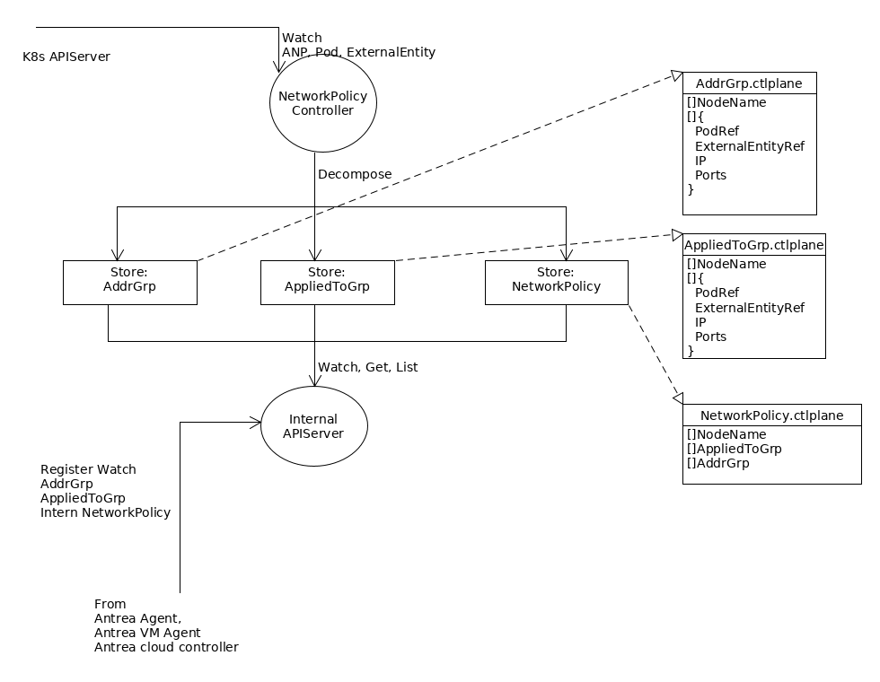

# Reuse Antrea Controller

This document describes incorporating ExternalEntity into span computation in
 NetworkPolicyController of Antrea Controller.



The above diagram illustrates high level components implementing NetworkPolicy span
computation and dispersion in the Antrea controller. They work as the following:

1. The NetworkPolicyController watches K8s APIServer for changes in NetworkPolicy.crd.antrea.io(ANP),
Pods and ExternalEntities.
 
1. The NetworkPolicyController decomposes a single ANP into one
 NetworkPolicy.controlplane.antrea.io, one or more AppliedToGroup.controlplane.antrea.io, and
 zero or more AddrGroup.controlplane.antrea.io, where
   - An AppliedToGroup.controlplane.antrea.io represents Spec.AppliedTo.PodSelector or 
   Spec.AppliedTo.ExternalEntitySelector of the original ANP, it may contains 
       - ``Pods`` is a set of Pods computed via ANP.Spec.AppliedTo.PodSelector of the original ANP
       NetworkPolicy. Each member in Pod set includes reference to Pod, Pod IP and Pod Ports.
       - ``ExternalEntities`` is set of ExternalEntities computed via 
       ANP.Spec.AppliedTo.ExternalEntity.Selector. Each member in Pod set includes reference to 
       ExternalEntity, ExternalEntity IPs and ExternalEntity Ports.
       - ``NodeNames`` is a set of NodeNames that is union of K8s Pod.Spec.NodeName of Pod set 
       ExternalEntity.Spec.ExternalNode of ExternalEntity set.
       - Each AppliedToGroup is referenced by one or more internal 
       NetworkPolicy.controlplane.antrea.io.
   - An AddressGroup.controlplane.antrea.io represents To/From field of PodSelector or 
   ExternalEntitySelector in the original ANP, it contains  
       - ``Pods`` is a set of Pods computed via<br>
       ANP.Spec.[Ingress|Egress].[From|To].PodSelector of the original ANP. Each member
       in Pod set includes reference to Pod, Pod IP and Pod Ports.
       - ``ExternalEntitis`` is a set of ExternalEntities computed via<br>
       ANP.Spec.[Ingress|Egress].[From|To].ExternalEntitySelector of the original ANP. Each member
       in ExternalEntity set includes reference to ExternalEntity, its IP and Ports.
       - Each AddresssGroup is referenced by one or more internal NetworkPolicy.controlplane.antrea,io.
       - ``NodeNames`` is a set of NodeNames that is union of ``NodeNames`` of all
       NetworkPolicy.controlplane.antrea.io referencing to this AddressGroup.
   - a NetworkPolicy.controlplane.antrea.io, in the context of this discussion, contains
       - References to one or more AppliedToGroups.
       - References to zero or more AddressGroups.
       - ``NodeNames`` is a set of NodeNames that is union of ``NodeNames`` of all
       AppliedtoGroups referenced by this NetworkPolicy.
1. The control plane AppliedToGroup, AddressGroup, and NetworkPolicy are cached in its corresponding
Stores. Any changes to ANP or associated Pods, ExternalEntity may trigger changes to
corresponding AppliedToGroup, AddressGroup, or NetworkPolicy in their Stores.
1. The Antrea controller's internal APIServer is hooked up to each of the Stores, 
so it may Get, List, or Watch changes to control plane AppliedToGroup, AddressGroup, and
 NetworkPolicy.
1. Antrea agent registers with the internal APIServer to watch changes to AppliedToGroup
, AddressGroup, and NetworkPolicy with Antrea agent's local NodeName as selecting criteria.
1. Antrea VM agent registers with the internal APIServer to watch changes to AppliedToGroup
, AddressGroup, and NetworkPolicy with VM ID as selecting criteria.
1. Antrea cloud controller registers with the internal APIServer to watch changes to AppliedToGroup
, AddressGroup, and NetworkPolicy with "cloud" keyword as selecting criteria.
1. The internal API server pushes CRD changes to an Antrea/VM agent's watch channel only if that
 CRD's``NodeNames`` set includes NodeName selecting criteria used by the Antrea/VM agent. 
 

The following describe ANPs applying to VMs and Pods, and their conversion to control plane objects.
Assuming in our cluster we have the following setup
- namespace pod-ns, containing two Pods named pod1 and pod2, and both Pods reside on Node test-node.
- namespace vm-ns, container two VMs -- vm1 and vm2.
- each of vm1, vm2 also generates corresponding ExternalEntities, externEntityVm1, externEntityVm2.

An ANP may be applied applies to Pods pod1 and pod2,  allowing egress traffic from pod1 and
pod2 to all vms, as such 

```yaml
apiVersion: crd.antrea.io/v1alph1
kind: NetworkPolicy
metadata:
  name: pod-policy
  namespace: pod-ns
spec:
  podSelector: 
    matchExpressions:
      - key: name
        operator: in
        values:
          - pod1
          - pod2
  policyTypes:
    - Engress
  egress:
  - to:
    - namespaceSelector:
        matchLabels:
          name: vm-ns
      ExternalEntitySelector: {}
```
This ANP then is translated into the following internal control plane CRDs by Antrea controller.
These control plane CRDS are in turn  transmitted via watch channel to Antrea Agent on Node
test-node.
| Object              | Content               | NodeName  |
|---------------------|-----------------------|-----------|
| AppliedToGroup      | Pod1Ref,Pod2Ref       | test-node |
| NetworkPolicy       | AppliedToGrp, AddrGrp | test-node |
| AddressGroup        | ExternEntityVM1Ref,   | test-node |
|                     | ExternEntityVM2Ref    |           |           


An ANP may also be applies to VM vm1 and allows ingress traffic (to vm1) from VM vm2.
```yaml
apiVersion: crd.antrea.io/v1alph1
kind: NetworkPolicy
metadata:
  name: vm-policy
  namespace: vm-ns
annotation: 
  owner.networkpolicy.crd.antrea.io: cloud
spec:
  ExternEntitySelector: 
    matchName:
      name: ExternEnityVm1
  policyTypes:
    - Ingress
  Ingress:
  - from:
    - ExternalEntitySelector:
        matchName:
          name: ExternalEntityVm2
```

This ANP is translated into the following internal control plane CRDs by Antrea controller.
These control plane CRDS are in turn  transmitted via watch channel to Antrea cloud controller
. Note we assume VM is running agent-less mode in this example.

| Ojbect              | Content                            | NodeName |
|---------------------|------------------------------------|----------|
| AppliedToGroup      | ExternEntityVM1Ref                 | cloud    |
| NetworkPolicy       | AppliedToGrp, AddrGrpVM            | cloud    |
| AddrGrpVm           | ExternEntityVm2Ref                 | cloud    |
