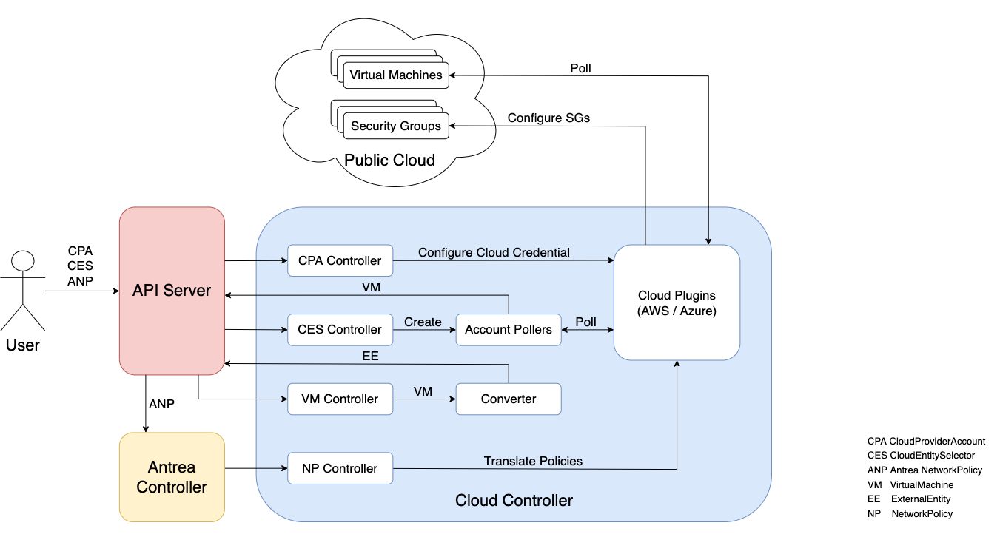

# Cloud Controller Architecture

The Cloud Controller supports micro-segmentation by realizing
[Antrea NetworkPolicies](https://github.com/antrea-io/antrea/blob/main/docs/antrea-network-policy.md)
on Public Cloud Virtual Machines. It leverages cloud network security groups to
enforce Antrea NetworkPolicies. The Cloud Controller supports enforcing policy on AWS
and Azure Cloud VMs. The support for different public cloud platforms are designed
to be a pluggable architecture. Such design enables extending support to other cloud
platforms in the future.

The Cloud Controller onboards public cloud VMs onto the Kubernetes cluster as
`VirtualMachine` CRDs and converts them into `ExternalEntity` CRDs. The users
will use `ExternalEntity` CRDs to define custom Antrea NetworkPolicies. The
Cloud Controller translates these Antrea NetworkPolicies into cloud-native network
security groups and security rules. These security groups are then attached to
Public Cloud VMs.

## Components

The following diagram illustrates the Cloud Controller components and the relevant
resources in a Kubernetes cluster.

### Cloud Provider Account (CPA) Controller

The CPA controller interfaces with the cloud providers APIs, and it is
responsible for management of cloud accounts. The CPA controller watches
`CloudProviderAccount` CR resources specified by the user, and sets up cloud
access in the cloud plugin. It extracts credentials from the CR and initializes
cloud sessions, which is then consumed by the account poller, network policy
controller etc.

### Cloud Entity Selector (CES) Controller

The CES controller watches `CloudEntitySelectors` CR specified by the user. It
extracts the specified `CloudProviderAccount` and the match selectors in the 
CR. It scans corresponding cloud providers' VPC / VNet, discovers matching
cloud resources such as VMs, and caches them. An account poller is configured by
the controller in the same Namespace as the `CloudEntitySelector`.

### Account Poller

Account poller is created for each configured `CloudEntitySelector` at the
Namespace level. On every polling interval, the account poller accesses
Cloud-Interface plugin routines and gets all cached cloud resources.
For each cloud resource, it creates a corresponding VirtualMachine CRD and
imports them into the same namespace as the `CloudEntitySelector`.
It compares the cloud resources stored in `etcd` against the cloud
resources fetched and identifies which cloud resources needs to be created,
updated, and deleted. Then, the `etcd` is updated.

### Virtual Machine (VM) Controller

The Virtual Machine Controller watches `VirtualMachine` CR and forwards the
updated CR object to the Converter module.

### Converter

The Converter receives source CR objects from corresponding CRD controllers and
converts them into matching target CRD objects, which will be consumed by
Antrea Controller and NP Controller. Each target object has K8s Labels that
matches cloud resource properties, such as Kind, Name, VPC / VNET, tags. It may
also contain IP addresses of cloud resources when applicable.

- The source package implements the target interface which the source is
  intended to be converted to. It also contains the core converter logic, which
  utilizes the helper functions in target package to generate target resource
  and perform operations on target CRs in the API Server.
- The target package defines an interface specifying information getters it
  needs and provides series of helper functions to populate target resource
  objects.

### Antrea Controller

The Antrea Controller watches to the changes in Antrea NetworkPolicy, and computes
the scopes, translates to appropriate Antrea internal network policy, and disperses
them accordingly to Antrea CNI agent or Cloud Controller. In order for it to support
Cloud use case, the antrea controller understands `ExternalEntity` CRD and
`externalEntitySelector` fields, and use them accordingly for ANP span computation
and dispersion.

### Network Policy (NP) Controller

The NP controller watches for the `NetworkPolicy` events from the
`antrea-controller`. The `antrea controller` guarantees that any internal
network policy and the associated CRDs are pushed to the NP controller, while
the NP controller guarantees that NetworkPolicies are applied to Public Cloud
VMs managed by the `cloud controller` instance. It will translate network
policies into one or more cloud security groups and cloud security rules. The NP
controller uses cloud plugins to attach the security groups to the cloud VMs.
For more information, please refer to [NetworkPolicy document](networkpolicy.md).

### Cloud Plugins

The cloud plugins are used by other components to access cloud resources. It
stores cloud account information configured by the CPA controller and initiates
cloud sessions. It is built with a [plugin model](design-cloud-plugin.md).
This enables extending the controller to support different clouds. Currently
supported plugins include:

- AWS
- Azure
