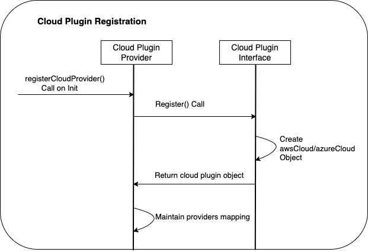
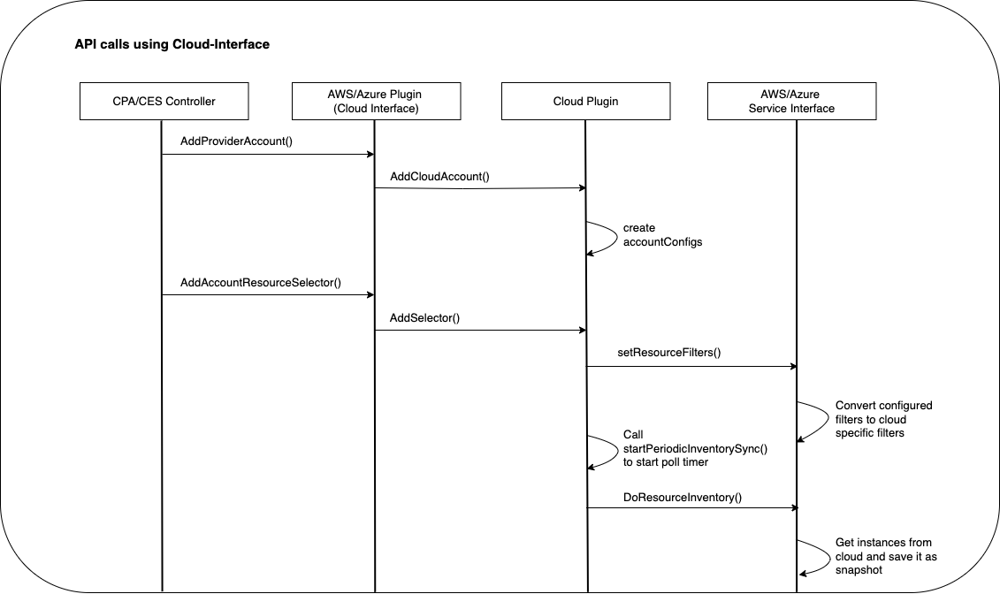

# Cloud Plugin Design

## 1. Overview

This document covers the design details of Cloud Plugin component in
`cloud controller`. Cloud Plugin module uses a plugin-based mechanism to
integrate with the public cloud, wherein it is easier to add new cloud support
in `cloud controller`. Currently, the Cloud Controller project supports AWS and
Azure public cloud.

### 1.1 Expectations

- Should be easier to add new cloud support.
- Should support multiple clouds.
- Should support multiple cloud accounts for a cloud.
- Should maintain a clear separation across clouds (code and build structure)
  without any interdependency across clouds.
- Should provide a common framework to synchronize inventory from the cloud
  accounts, for each of the supported cloud services.
- Should support cloud resource selection for a cloud account.

## 2. Cloud Plugin Components

The Cloud Plugin module internally can be divided into Cloud Provider Plugin,
Cloud Interface Plugin, Common Plugin Framework, and Cloud Specific Service
Interface subcomponents. Each of these subcomponents is discussed in this
section along with sequence diagrams and a UML diagram.

### 2.1 Cloud Provider Plugin

The Cloud Provider Plugin component maintains the information about registered
cloud plugins. Each cloud plugin on initialization gets registered with Cloud
Provider Plugin. Once registered, cloud plugins are cached internally in a
map of cloud type to [Cloud Interface plugin](design-cloud-plugin.md#22-cloud-interface-plugin).
It exposes APIs to allow other components in `cloud controller` to get
Cloud Interface plugin implementation for a specific cloud type.

The sequence diagram shows cloud plugin registration as part of `cloud controller`
initialization.



### 2.2 Cloud Interface Plugin

The Cloud Interface plugin is a `CloudInterface` interface implemented by
each cloud plugin. Cloud Interface plugin is composed of the following
interfaces:

**ComputeInterface**: 
- Provides APIs to get compute instances inventory in terms
  of VirtualMachine for a cloud.

**AccountMgmtInterface**:
- Provides APIs to add/remove/update cloud accounts using CloudProviderAccount
  CRD.
- Provides APIs to add/remove/update cloud resource selectors using
  CloudEntitySelector CRD.

**SecurityGroupInterface**:
- Provides APIs to realize Kubernetes network policy via the cloud native
  security groups.

The sequence diagram shows following Cloud Interface API calls made from
`CloudProviderAccount`(CPA) and `CloudEntitySelector`(CES) controllers
respectively.

- `AddProviderAccount()` function onboards a cloud account and stores all
  account specific details as part of
  [Common Plugin Framework](design-cloud-plugin.md#23-common-plugin-framework).
- `AddAccountResourceSelector()` function stores the specified match selectors
  for a cloud resource, in the cloud-specific format. It creates a periodic sync
  timer for syncing cloud inventory. The cloud resources that match the
  configured selectors, are fetched from the cloud and stored in the cloud
  [Service Interface](design-cloud-plugin.md#241-cloud-service-interface)
  level.



### 2.3 Common Plugin Framework

The Common Plugin Framework provides functionality that is common across all
clouds, allowing each cloud plugin to implement cloud-specific functionality.

The following functionality is provided by the Common Plugin Framework:

1. Cloud Account Management: Account management includes add/remove/update of
   cloud accounts and maintaining them. `CloudAccountConfig` and
   `CloudCommon` structures show this association in the
   [UML diagram](design-cloud-plugin.md#3-component-interaction-uml-diagram)
   where,
- `CloudAccountConfig` implements `CloudAccountInterface` interface for account
  management.
- `CloudCommon` implements `CloudCommonInterface` interface, uses
  `CloudAccountConfig` objects for storing each cloud account specific details.
- Both AWS and Azure cloud-specific plugin object contains `CloudCommon`,
  thereby gets access to cloud account details stored in Common Plugin Framework.
  In the [UML diagram](design-cloud-plugin.md#3-component-interaction-uml-diagram),
  `awsCloud` structure contains `CloudCommon` and the arrows show composition
  relationship between them.

3. Cloud Service Management: At the account level, it maintains information
   required for managing registered services, which can include configured
   filters, resource CRDs and inventory statistics for each registered service.
   For this purpose, `CloudServiceInterface` [service interface](design-cloud-plugin.md#241-cloud-service-interface)
   is used by `CloudAccountConfig` as indicated in the [UML diagram](design-cloud-plugin.md#3-component-interaction-uml-diagram)
   and cardinality on the arrow shows that every cloud account can include
   multiple service interfaces based on the number of services supported by each
   cloud.
4. Periodic sync of cloud inventory for each cloud account is performed for all
   services registered for a cloud account.

### 2.4 Cloud Specific Plugin

In addition to implementing Cloud Interface on each cloud plugin, it also needs
to provide handling for cloud-specific modules discussed below:

##### 2.4.1 Cloud Service Interface

Each cloud supports multiple services and each service has its own cloud exposed
SDK APIs. These SDK APIs are used to get details for that service from Cloud. To
provide a unified way to get service details (like service inventory etc.) across
Clouds, each service implements a service interface `CloudServiceInterface` to
expose its functionality to [Common Framework Plugin](design-cloud-plugin.md#23-common-plugin-framework).

For example, in the case of AWS cloud, AWS plugin needs to implement a service
interface `CloudServiceInterface` for cloud service like EC2. `ec2ServiceConfig`
in the [UML diagram](design-cloud-plugin.md#3-component-interaction-uml-diagram)
indicates EC2 service supported by AWS Cloud. While implementing service
interfaces, it uses `CloudServiceResourceCache` and `CloudServiceStats`
structures for caching cloud resources and storing poll statistics respectively.

##### 2.4.2 Credential Management

Each cloud has its own way of handling account credentials. Hence, credentials
management functionality needs to be provided by each cloud, and it needs to be
exposed to Common Plugin Framework using `CloudCommonHelperInterface`. Similarly,
cloud service interface implementation on each cloud is injected into the Common
Plugin Framework by `CloudCommonHelperInterface`.

## 3. Component Interaction UML Diagram

UML diagram takes an example of AWS cloud to show cloud-specific plugin design.
Refer [components of cloud provider module](design-cloud-plugin.md#2-cloud-plugin-components)
for details on Cloud Interface Plugin, Common Plugin Framework, and Cloud
Specific Plugin.


## 4. Developing Cloud Plugin Workflow

#### 4.1 Add cloud-plugin type

Update `apis/crd/v1alpha1/cloudprovideraccount_types.go` to have new const added
for new cloud type as shown below.

```go
type CloudProvider string

const (
	// AzureCloudProvider specifies Azure.
	AzureCloudProvider CloudProvider = "Azure"
	// AWSCloudProvider specifies AWS.
	AWSCloudProvider CloudProvider = "AWS"
	// ADD NEW CLOUD TYPE HERE
)
```

#### 4.2 Create cloud plugin package

Add new package under 'pkg/cloud-provider/cloudapi' package for the new cloud
files.

```build
├── pkg
│   ├── cloud-provider
│   │   ├── cloudapi       <<======== Add new cloud pkg under cloudapi pkg (similar to aws, azure)
│   │   │   ├── aws
│   │   │   ├── azure
│   │   │   ├── common
│   │   │   └── internal
```

#### 4.3 Implement Cloud-interface

Similar to `aws_cloudinterface_impl.go` add a new file under newly created pkg
for the cloud `xxx_cloudinterface_impl.go`. Copy the contents of
`aws_cloudinterface_impl.go` to the new file and change the string `aws` to new
cloud name everywhere.

#### 4.4 Service Registration

Implement Service Interface for each service supported for this cloud as
referred in the [UML diagram](design-cloud-plugin.md#3-component-interaction-uml-diagram).
This will be cloud-specific implementation and hence use cloud-provided SDK APIs
to implement the service interface. Service will maintain its own cache and
config for cloud-discovered resources. Also, it will provide converters to
convert cloud resources to CRDs.

#### 4.5 Credentials Management

Credentials management will involve the conversion of user-provided credentials
to cloud format and validation of cloud credentials. Cloud will need to register
credential validator with Common Plugin Framework.