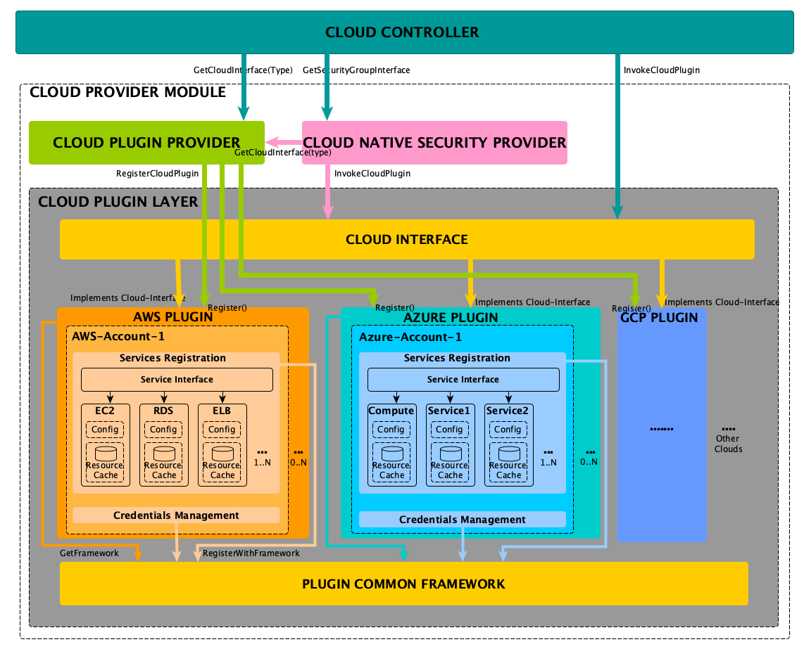

# Antrea-plus Cloud Provider Module Design

## 1 Overview
This document covers design details of Antrea-plus Cloud Provider Module. Antrea-plus will support multiple clouds towards
achieving its design goal (refer antrea-plus core design for details). Cloud provider module will provide multiple clouds 
support by adopting a plugin based mechanism allowing new clouds to be integrated easily with Antrea-plus using plugins.  
### 1.1 Expectations
 - Should support multiple clouds.
 - Should provide easy steps to add new cloud support.
 - Should maintain clear separation across clouds (code and build structure) without any inter-dependency across clouds.
 - Should provide a common framework to sync inventory from cloud accounts for each of the supported cloud services.
 - Should support multiple cloud accounts for a cloud.
 - Should support cloud resource selection for a cloud account.

## 2 Components of Cloud Provider Module
Following block diagram provides a high level view of components of cloud provider module and their interactions. Cloud 
Controller will call into cloud provider module to perform any operation on the supported cloud as shown in diagram below.



### 2.1 Cloud Plugin Provider
Cloud Plugin Provider component maintains the information about registered cloud plugins. Each cloud-plugin on initialization
 will get registered with Cloud Plugin Provider. Registered cloud-plugin information is maintained in terms of mapping of 
 cloud plugin cloud-type to cloud-interface implementation for that cloud-type. It exposes APIs to allow Cloud Controller 
 to get cloud-interface implementation for specific cloud-type. This component uses Cloud-interface (refer 2.3).

### 2.2 Cloud Native Security Provider
Cloud Native Security Provider component enables Kubernetes network policy to be realized on cloud instances by using 
cloud-native security constructs. Each cloud has unique way of realizing security and hence Cloud-native security constructs 
for each cloud are not the same. Cloud Native Security Provider component provides a unified way across clouds (AWS, Azure) 
by hiding cloud specific security construct details and exposing cloud independent security-group interface to cloud 
controller. This component uses Cloud Plugin Provider (refer 2.1) and Cloud-Interface (refer 2.3).

#### 2.3 Cloud-Interface
Cloud-interface is a common interface implemented by each cloud plugin. Cloud interface is composed of following
interfaces :
##### 2.3.1 ComputeInterface
    - Provides APIs to get compute instances inventory in terms of VirtualMachine and NetworkInterface CRDs for a cloud.
##### 2.3.2 AccountMgmtInterface
    - Provides APIs to add/remove/update cloud accounts for a cloud using CloudProviderAccount CRD.
    - Provides APIs to add/remove/update cloud account resource selector for a cloud using CloudEntitySelector CRD.
##### 2.3.3 NativeServicesInterface
    - Provides APIs to get native services (LoadBalancer, Databases etc) inventory in terms of NativeService and NetworkInterface 
    CRDs for a cloud account.
##### 2.3.4 SecurityGroupInterface
    - Provides APIs to realize Kubernetes network policy in terms of cloud native security constructs for a cloud.   
    
##### 2.4 Clouds
As part of adding support for a cloud in Antrea-plus, each cloud adds its plugin implementing Cloud-interface (refer 2.3). 

Along with cloud-interface, each cloud plugin also needs to provide handling for below cloud specific modules:
###### 2.4.1 Services Registration
Each Cloud supports multiple services and each Service has its own cloud exposed SDK APIs. These SDK APIs are used to get
details for that service from Cloud. To provide a unified way to get service details (like service inventory etc) across 
Clouds, each service will implement a Service-Interface (refer 2 and 3) to expose its functionality to Plugin Common 
Framework (refer 2.5). For example in case of AWS, AWS plugin needs to implement service-interface for cloud services 
like EC2, RDS, ELB.
###### 2.4.2 Credential Management
Each Cloud has its own way of handling account credentials. Hence, Credentials management functionality needs to provided
by each cloud and will be exposed to Plugin Common Framework (refer 2.5).

#### 2.5 Plugin Common Framework
Plugin Common Framework provides functionality common across all clouds allowing each cloud plugin to concentrate only on
implementing cloud specific functionality.

Following functionality will be provided by Common Framework:
1. Cloud account management. Account management includes add/remove/update of cloud account.
2. Periodic sync of cloud inventory for each cloud account. For all services registered for cloud account inventory sync
will be performed as part of account cloud inventory sync.

## 3 Component Interaction UML Diagram


## 4 Developing Cloud Plugin Workflow
## 4.1 Add cloud-plugin type
Update 'apis/crd/v1alpha1/cloudprovideraccount_types.go' to have new const added for new cloud type as shown below.
```go
type CloudProvider string

const (
	// AzureCloudProvider specifies Azure.
	AzureCloudProvider CloudProvider = "Azure"
	// AWSCloudProvider specifies AWS.
	AWSCloudProvider CloudProvider = "AWS"
	// GCECloudProvider specifies GCE.
	GCECloudProvider CloudProvider = "GCP"
	
        // ADD NEW CLOUD TYPE HERE
)
```
## 4.2 Create cloud plugin package
Add new package under 'pkg/cloud-provider/cloudapi' package for the new cloud files.
```build
├── pkg
│   ├── cloud-provider
│   │   ├── cloudapi       <<======== Add new cloud pkg under cloudapi pkg (similar to aws, azure, gcp)
│   │   │   ├── aws
│   │   │   ├── azure
│   │   │   ├── common
│   │   │   ├── gcp
│   │   │   └── internal
```
## 4.3 Implement Cloud-interface
Similar to aws_cloudinterface_impl.go file add new file under newly created pkg for the cloud (xxx_cloudinterface_impl.go).
Copy the contents of aws_cloudinterface_impl.go to this file and change the string aws to new cloud name everywhere.
## 4.3 Service Registration
Implement Service Interface (refer 3 UML diagram) for each service supported for this cloud. This will be cloud specific 
implementation and hence use cloud provided SDK APIs to implement service interface. Service will maintain its own cache 
and config for cloud discovered resources. Also, will provide converters to convert cloud resource to CRDs.
## 4.5 Credentials Management 
Credentials management will involve conversion of user provided credentials to cloud format and validation of cloud credentials.
Cloud will need to register credential validator with Plugin Common Framework. 

