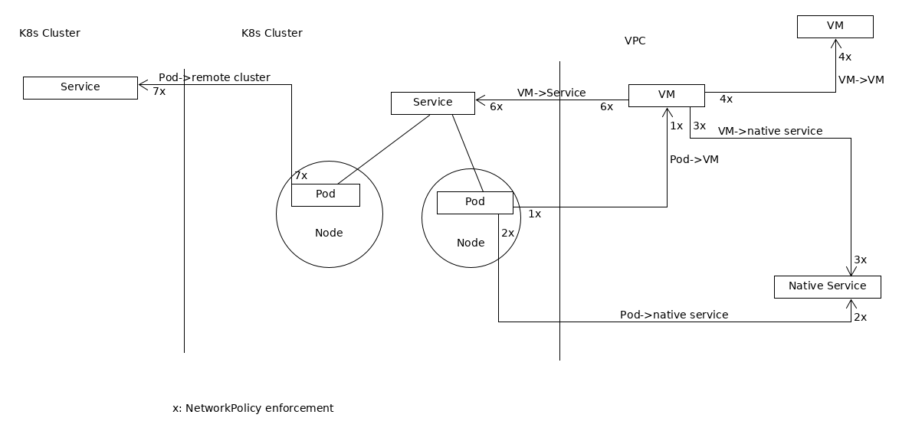
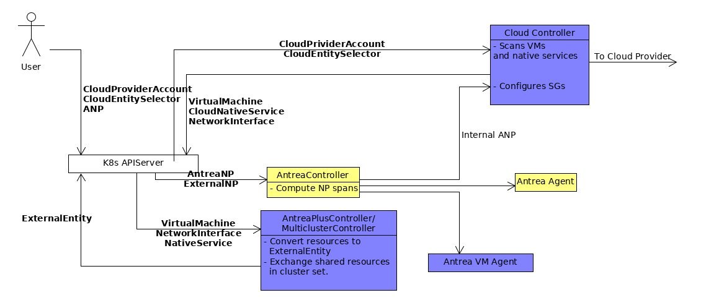
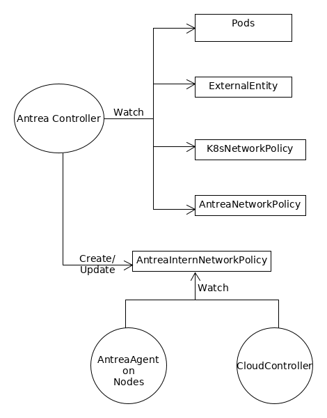
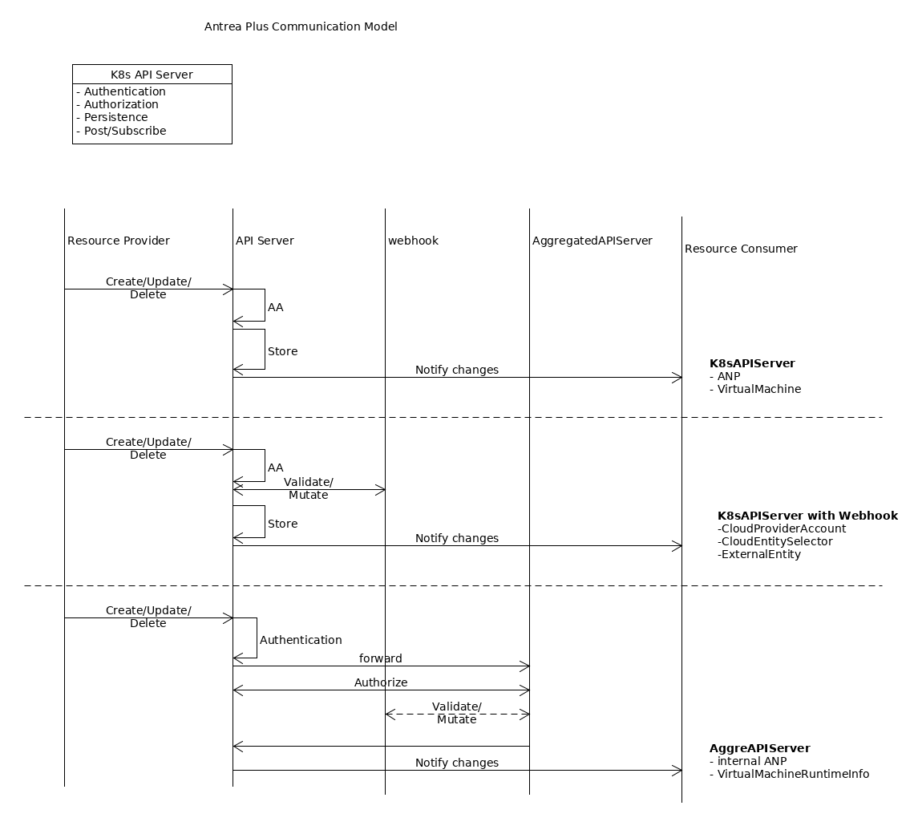
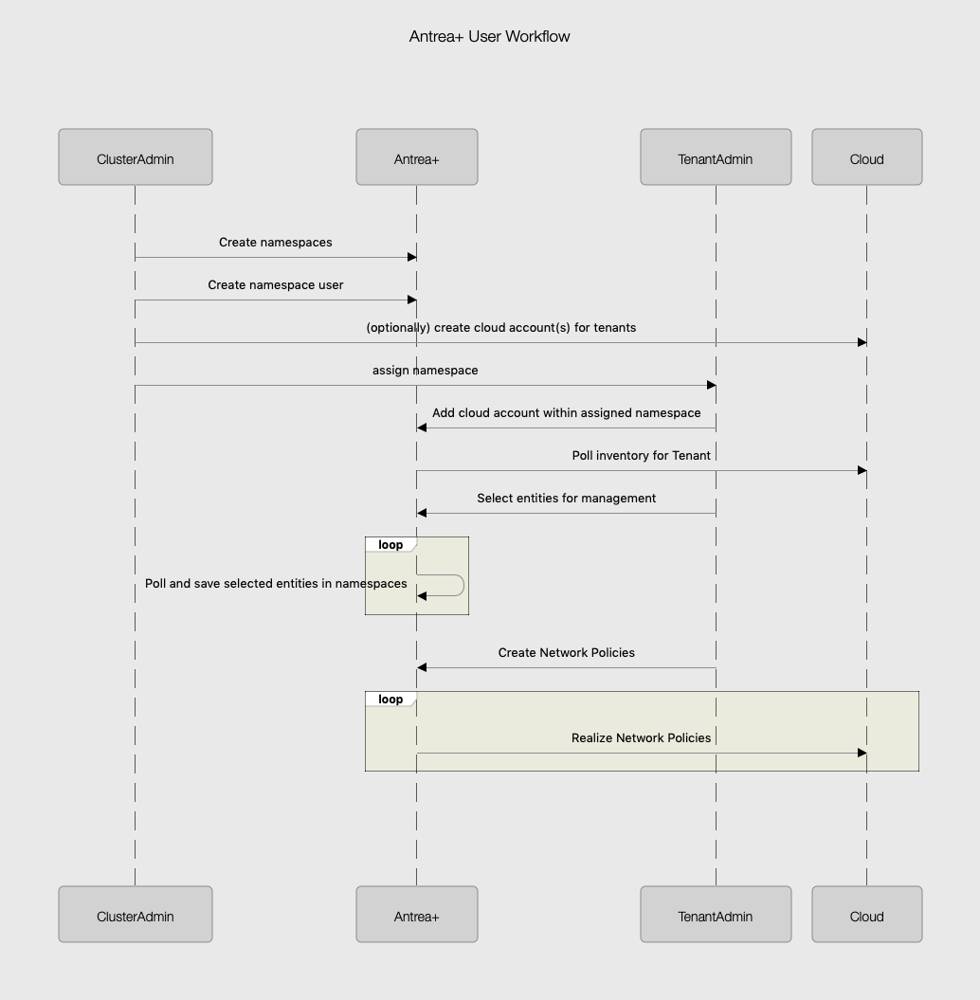

# Antrea-Plus Core Design

The Antrea Plus project supports Antrea Network Policy enforcement across different
k8s clusters and VMs. 
## Goals
1. Applying Antrea NetworkPolicy to VMs.
1. Applying Antrea NetworkPolicy across K8s cluster and VMs.
1. Applying Antrea NetworkPolicy across different K8s clusters.
     1. Assumption: Inter-cluster service accessible.
1. A single K8s control plane is used for configuring and querying NetworkPolicy for multiple K8s
 clusters.
1. VMs supports both agented or agentless mode. Agentless enforcement of policies depend on
 underlying cloud provider
1. Flexible deployment model
    1. VMs only.
    1. K8s clusters.
    1. K8s clusters and VMs.

## Internal Goals
1. K8s clusters may be added or removed freely as requirements arise.
1. Fast development cycle, reuse exiting open source Antrea as much as possible.

The following diagram shows all possible connectivity of VMs, cloud native services, Pods, 
and NetworkPolicy enforcement points. The arrow is direction of the traffic, and "*x*"s are
potential NetworkPolicy enforcement points.



1. Pod to VM traffic may be enforced on egress direction from Pod, but not ingress direction to
 VM. This is because source IP addresses of ingress traffic is SNATted.
2. Similarly, Pod to native service traffic may be enforced on egress direction from Pod, but not
 ingress direction to the cloud native service.
3. VM to cloud native service traffic may be enforced on both egress and ingress direction.
. (Implementation missing on ingress direction to native service)
4. VM to VM traffic may be enforced on both egress and ingress direction.
5. Pod to remote K8s Service traffic may be enforced on egress and ingress direction. It works with
 multiple cluster setup where Services may be advertised across the cluster set.
1. VM to K8s Service traffic may be enforced on both egress and ingress direction. Note ingress
 direction, the actual enforcement point cannot be on K8s Service because it is not an true
  entity, but on Pods that realizes the K8s Service.

## Third Party Dependencies

* [Antrea](https://github.com/antrea-io/antrea/): Provides Antrea NetworkPolicy (ANP) CRD
, controller that computes ANP spans, and agent as K8s CNI.
* [cert-manager](https://github.com/jetstack/cert-manager): Provides in cluster authentication
 for Antrea Plus CRD webhook servers.

## Deployment Modes
Antrea Plus may be deployed in a standalone cluster, or multiple connected clusters to form a
cluster set. The cluster set design are detailed in [here](federation.md),
[here](https://confluence.eng.vmware.com/display/ANP/Multi-Cluster+Design), and 
[here](https://confluence.eng.vmware.com/display/ANP/Multi-Cluster+DataPlane+Design).
The remain of this document deals with software components and CRDs used in a standalone cluster, 
but they are also applicable cluster set deployment.  

## Components

The following diagram illustrates the components and relevant K8s resources in an Antrea Plus
cluster. The blue blocks are Antrea Plus components;  the yellow blocks are Antrea componments; the
arrows presents resources flowing from source to destination. 



### Cloud Controller
This controller interfaces with the cloud providers APIs and is responsible for management of cloud
accounts and inventory collections across various accounts.
Each K8s cluster may contain exactly one CloudController instance; sharding is not currently
supported.

The CloudController monitors CloudEntitySelectors specified by user, and 
based on their contents. 
- It scans corresponding cloud providers' VPC/VNet, and discovers matching cloud resources such
 as VM or cloud native services.
- For each cloud resources, it creates corresponding VirtualMachine, NetworkInterface, and
CloudNativeService CRD and imports them into the same K8s namespaces of the CloudEntitySelectors. 

A CloudController also watches Antrea Controller's internal NetworkPolicy via
K8s API server. The Antrea Controller guarantee
that any internal NetworkPolicy and associated CRDs pushed to the CloudController are applied to
cloud resources managed by this CloudController Instance.

CloudController is built with a [plugin model](./design-cloud-provider-module.md). 
This enables extending the controller
to support different clouds. Currently supported plugins include: 
- AWS
- Azure

#### Core Antrea Controller
The Antrea Controller watches to the changes in K8s NetworkPolicy and AntreaNetworkPolicy, and
computes the scopes, translates to appropriate Antrea internal networkPolicy, and disperses them
accordingly to Antrea CNI agent, cloud controller or VM agent. In order for it to
upport Antrea Plus's cloud use case, the antrea controller understands EXternalEntity CRD and
 ExternalEntitySelector fields, and use them accordingly for ANP span computation and dispersion
  as described in this [document](./antrea-controller.md).

### Antrea Plus Controller
An Antrea Plus controller instance may be run per Namespace in a k8s cluster. Each
AntreaPlusController the following modules.

#### Manages ExternalExternalEntity
The ExternalEntityController manages ExternalEntity resources.
. It creates matching ExternalExternalEntity for each VirtualMachine, cloud NativeService, and
 NetworkInterface.
* Each ExternalEntity has K8s Labels that matches cloud resource properties, such as Kind, Name
, VPC/Vnet, tags. It may also contain IP addresses of cloud resources when applicable. 

#### Resources Exchange
The federationManager/multiClusterManager configures cluster set and exchanges shared resources
among the cluster set. This module will be transferred to upstream Antrea.

### VM agent
The VM agent is install on each VMs that runs in agented mode. The VM agent allows VM firewalls
 be executed via on host OVS as oppose to cloud provider security groups. The detailed design of
VM agent is in this [document](./vm-agent.md).

 
## CRDs

The purpose of the CRDs have not changed, though the actual contents may be evolved significantly
. For latest CRD declarations, please see this [directory](../apis/)

#### CloudEntitySelector
```golang
// CloudProvider may be AWS, Aazure, OnPrem, GPC, etc
type CloudProvider string
// SelectorType may be VM, NativeService
type SelectorType string

// CloudEntitySelectorSpec is Spec for CloudSelector
type CloudEntitySelectorSpec struct {
	// Type indicates the type of CloudSelector
	Type SelectorType `json:"type"`
	// CloudProvider selects cloud entities in this CloudProvider
	CloudProvider CloudProvider `json:"cloudProvider"`
	// VpcID selects cloud entities in VPC VpcID
	VpcId string `json:"vpcId,omitempty"`
	// TODO more selection criteria as required
}

// CloudEntitySelector selects cloud entities importing to K8s cluster.
type CloudEntitySelector struct {
	metav1.TypeMeta   `json:",inline"`
	metav1.ObjectMeta `json:"metadata,omitempty"`
	Spec              CloudSelectorSpec `json:"spec"`
}
```
Resource CloudEntitySelector is configured by user and is consumed by a CloudController
instance. The CloudController uses it to determine what VMs and cloud native services that 
need to be imported.

#### Cloud Resources
```golang
// TODO NetworkInterface will be replaced by Antrea.NetworkInterface.
type NetworkInterface struct {
 // TODO fill in
}

type VirtualMachineSpec struct {
	// List of NetworkInterfaces attached to VM.
	NetworkInterface []v1.ObjectReference `json:"networkInterface,omitempty"`
}

type VirtualMachineStatus struct {
	// TODO exposed VM properties here
}

type VirtualMachine struct {
	metav1.TypeMeta   `json:",inline"`
	metav1.ObjectMeta `json:"metadata,omitempty"`
	Spec              VirtualMachineSpec   `json:"spec"`
	Status            VirtualMachineStatus `json:"status,omitempty"`
}

type CloudNativeServiceSpec struct {
	// ServiceName specifies the service corresponding to this cloud service.
	ServiceName string `json:"serviceName,omitempty"`
}

type CloudNativeServiceStatus struct {
	// TODO exposed cloud service properties here
}

type CloudNativeService struct {
	metav1.TypeMeta   `json:",inline"`
	metav1.ObjectMeta `json:"metadata,omitempty"`
	Spec              CloudNativeServiceSpec   `json:"spec"`
	Status            CloudNativeServiceStatus `json:"status,omitempty"`
}
```
Resources VirtualMachine, NetworkInterface CloudNativeService are created by CloudController
based on user input via CloudEntitySelector.

#### ExternalEntity
```golang
type ExternalEndPoints struct {
	metav1.TypeMeta   `json:",inline"`
	metav1.ObjectMeta `json:"metadata,omitempty"`
}
```
Resource ExternalEntity is declared in upstream Antrea. Each ExternalEntity represents a network
 entities outside of local K8s cluster. It is generated for each VM, cloud native service.  
 It may be selected in ANP's To/From and appliedTo field to identify those external network
 entities.

#### AntreaNetworkPolicy
ANP CRD is declared in upstream CRD. The following is the CRD view of ANP in Antrea Plus
context.<br> 


### Communication Channel
Antrea Plus implementation is a distributed system consists of software components that shares and
operates on K8s resources. The following diagram illustrated generic communication models used by
 Antrea Plus system.
 


The following table lists provider, consumer, and communication channel type for each K8s
resources used by Antrea Plus.
   
 | Resource    |  Provider   |  Consumer  | Channel Type  |
 |---          |---          |---         |---            |
 | VM/NIC | CloudController | AntreaPlusController | K8sAPIServer|
 | CloudProviderAccount | User | CloudController | K8sAPIServer with Webhook |
 | CloudEntitySelector  | User | CloudController | K8sAPIServer with Webhook |
 | ExternalEntity | AntreaPlusController | AntreaController | K8sAPIServer wtih webhook |
 | ANP | User | AntreaController | K8sAPIServer |
 | Internal ANP/AddrGrp/AppliedGrp | AntreaController | Agents/CloudController | AggrAPIServer |
 | VirtualMachineRuntimeInfo | VM Agent | CloudController | AggrAPIServer |  

  
### Tenancy 
In this section unless otherwise specified, a controller consists of one or more cloudController
and one or more CloudController Services in a K8s cluster.
-   Configurable tenancy model
-	Proposed Namespaces :
	    1. Tenant – Set of VPCs defined via a selector. By default each vpc is a separate tenant.
	        1. Tenant -- Namespace 1:1
	       Namespace -- VPC 1:n (based on some selector).
	    1. Namespace consistency across multiple K8s clusters. A Namespace with same
	    name on two different K8s will be considered as the same Namespace when resources are
	    propagated.
-	Support both hard and soft tenancy. In both models, resources belonging to each tenant is in its
    own namespace. A soft tenancy is where a single controller manages multiple tenants.
    A hard tenancy is where there is a controller per tenant. We will not support a case where
    more than 1 controller is managing the same tenant. For eg. 2 controllers
    cannot be for the same tenant since it will cause conflict and unknown behavior.
    System should try to prevent or alert when such an unsupported configuration is applied
-	Each controller should support a scale-out architecture regardless of the number of tenants
    it is managing. Some suitable sharding mechanism needs to be used.
-	When a resource is replicated to other clusters, each cluster will create similar namespaces
-	VMs within the VPC set are saved in the namespace and replicated across clusters
-	Each cloud controller is responsible for a set of tenants, defined via selectors
-	Users can deploy multiple cloud controllers in different clusters.
    Each controller managing non-overlapping set of tenants.
-	Each tenant can write policies in its namespace and can reference objects from other namespace.
    Eg policy in namespace "my-test" allows any POD in NS my-test to talk to VMs in namespace vm-vpc

```yaml
apiVersion: antrea.io/v1beta1
kind: AntreaNetworkPolicy
metadata:
  .....
  namepace: my-test
spec:
  podSelector:
  policyTypes:
    - Egress
  egress:
  - to:
    - ExternalEndpointSelector:
	   matchLabels:
	     vm_vpc: 5678
```

#### Namespace workflow
The users of AntreaPlus will have following personas:
- CloudAdmin : Administrator that is responsible for cloud Accounts. A Cloud Admin is
typically the IAM admin of public cloud accounts.
- ClusterAdmin : Responsible for creation and maintenance of the Antreaplus cluster.
ClusterAdmin will create namespaces for each Tenant that uses the system. ClusterAdmin
CloudAdmin may or may not be the same user.
- TenantAdmin : An admin responsible for specific set of resources on the cloud.
Each tenant is mapped to a separate namespace in AntreaPlus K8s cluster. We use k8s namespaces
for tenant isolation. A tenantAdmin has cloud account credentials for managing cloud resources
A tenantAdmin is also responsible for all network policies that are created within the assigned
namespace.

A typical workflow could look like this <br>


- ClusterAdmin sets up AntreaPlus and creates namespaces for each Tenant
- ClusterAdmin provides TenantAdmin access for the namespaces
- TenantAdmin adds cloud account in the assigned namespace using CloudAccount CRD
- TenantAdmin uses EntitySelector CRD to select entities that need to be managed in the cloud
account. Selection can be VPC or set of VMs and users can use different criteria like tags to
select the cloud resources that need to be managed. Agent or non-agented mode can be selected 
for each cloud VM.
- TenantAdmin can manage network policies within the assigned namespaces. AntreaPlus will
realize the policy either via agent or natively on the cloud depending on the mode selected.


## Cloud resource management

An AntreaPlus cluster may support one or more cloud accounts.
1. Each cloud account needs to map into a K8s cluster namespace to which K8s user has full
 access
 right.
1. Each cloud account may have its own namespace or share the namespace with other cloud accounts.
1. Each cloud account may associated with multiple namespaces. This allows multiple K8s users with
various privileges to configure NetworkPolicy on the same cloud resources.
1. Each cloud account may have a single associated CloudEntitySelector, this avoids potential
 configuration conflict if multiple CloudEntitySelectors on same cloud account is allowed.   
1. The namespace user can create/update/delete NetworkPolicies on cloud resources belongs to this
namespace. The networkPolicies may also refer to cloud/Pod resources from
outside of the namespace, but they may not be applied onto resources outside of the namespace.  
