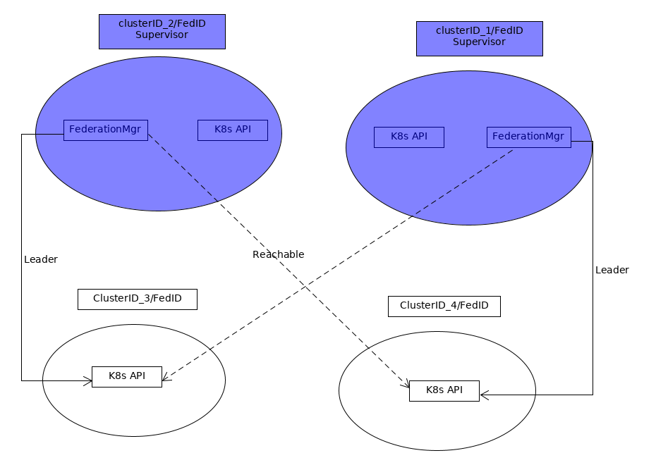
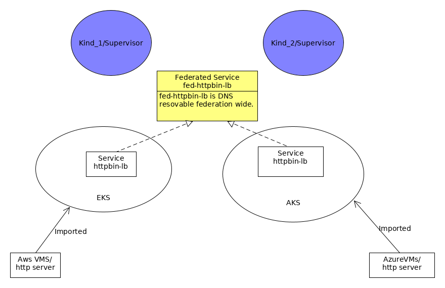
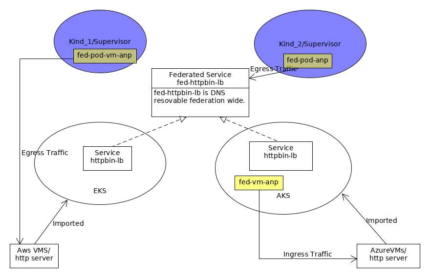

# What is AntreaPlus Federation

An AntreaPlus federation is 
*  a set of K8s clusters, with each member cluster configured with a same FederationID, and
 unique ClusterID within that cluster set.
* one or more member clusters are configured as supervisors. A supervisor cluster must
 
  - be able to connect to all clusters in the federation.
  - be given the permissions to access some resources in all member clusters.
* a Federation Manager is instantiated in each supervisor cluster. For each member cluster, this
 Federation manager joins the leader election process with Federation Managers in other
  supervisor clusters. A single leader Federation Manager shall be elected for a member cluster.
* A leader Federation Manager of a member cluster is responsible to manage all federated
 resources in that member cluster.
* AntreaPlus federation is fault tolerant to network, power, system failures.

 

# What are AntreaPlus Federated Resources

## Design Philosophy 
Choose to configure federated resources bottom up as oppose top down.

A top down approach is that a single federated resource is replicated to member clusters based on
 some rules, [Kubefed](https://github.com/kubernetes-sigs/kubefed) is the most prominent project
  using this approach. It has the following drawbacks:
 - Security: Each member cluster may have different security requirements and managed by
  different administrators. It is difficult to configure a federated resource that takes all
   member clusters into consideration.
 - Cost and Benefit: K8s resource replication is not a difficult task administratively, but
  implementing configure federated resource top down is not easy. Kubefed is a complex project
  , and by itself, it does not provide resource/Service sharing across federation.
  
A bottom up approach is that each member cluster configures its local resources, then decides if
 the resources should be exported to other members in the federation or use resources
 from other member clusters.
 
 ## Federated Service
 * A K8s Service may be exported to member clusters in the federation as a federated Service.
  * A federated Service is resolvable via DNS lookup in any member cluster in the federation, whereas
  the Pods backending the federated Services are ephemeral.
 * a federated Service may consists of K8s Services from one or more member clusters, of
  same or different Service type.
 * It is member cluster administrator's discretion and responsibility to ensure that any local
  Services exported as federated Services must be reachable outside the local member cluster. 
    

## Federated Antrea NetworkPolicy
* A federated Antrea NetworkPolicy is *always* applied to Pods, VMs etc of the local cluster, It
 can refer to resources (VMs, Services) in other member clusters in its ingress and egress rules.
* A federated Antrea NetworkPolicy must be explicitly specified as federated NetworkPolicy
, otherwise remote resources will not be considered.
* A federated Antrea NetworkPolicy's egress rule may include federated Services, remote VMs and
 other cloud resources with external IP addresses, but not remote Pods. This is because Pod's IP
  typically is not visiable outside of the member cluster.
* A federated Antrea NetworkPolicy's ingress rule may include remote VMs, and other cloud
 resources with external IPs, but not remote Pods. This is because Pod's traffic, when the
  destinations are not the same local member cluster, will typically its source IP addresses
   NATted.
  

# Deployment
* Require Antrea Agent/Controller to be deployed in all member clusters.
* Require AntreaPlus (includes Federation Manager and ExternalEntity Controller) controller to be
 deployed in all member clusters.
* Require AntreaPlus Cloud Controller to be optionally deployed in member clusters where cloud
 resources are imported.

# Demo
* AntreaPlus CLI
  - Streamlining tedious and static tasks, such as Federation configuration.
  -  A single point of control for all federation configuration and monitor need.
* Create a Federation.
* Federation Fault tolerant.
* Federated Service.
* Federated NetworkPolicy Egress.
* Federated NetworkPolicy Ingress.

# Continued Work (short term)
* Allow VM to discover federated Service
* Allow federated Service to include K8s Services from different Namespaces.(??)
* Test cases and bug fixes.  
