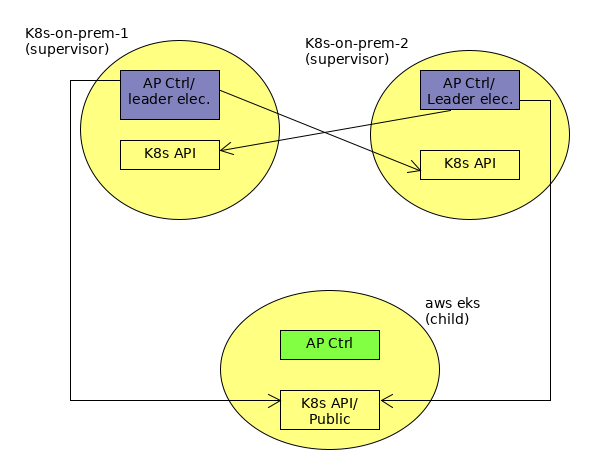
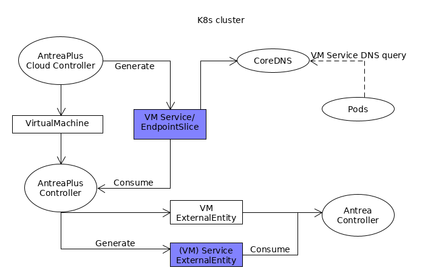
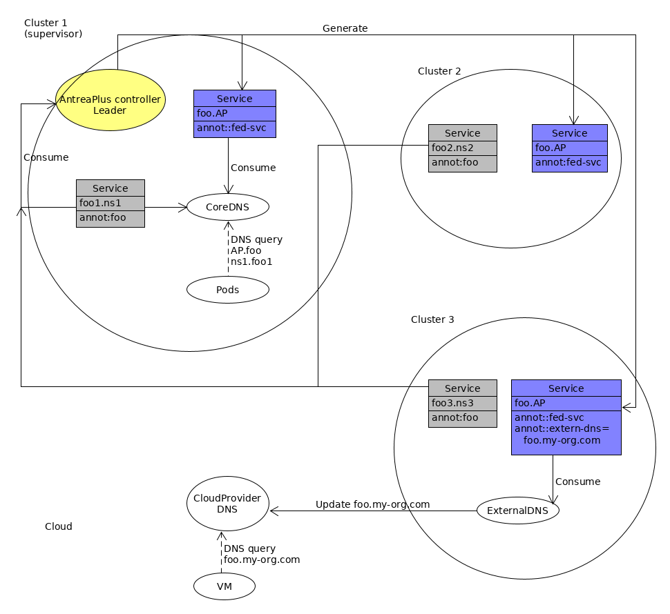

# Federation

## 1. Features
* Provides service discovery to containers/VMs across multiple k8s clusters.
* Provides uniformed Antrea Network Policy across multiple k8s clusters.

### 1.1 Summary

1. Users form an AntreaPlus federation.
1. Users may import VMs and other native services in each member cluster.
1. Users may decide which k8s Services should part of federated Services by annotation.
1. Any federated Service can be discovered by Pods and VMs of all member clusters.
1. Users may decide which Antrea NetworkPolices should be federated via annotation, federated
 ANPs control VMs and Pods traffic for the entire AntreaPlus federation.
1. The federated ANPs are replicated to all relevant member clusters so that they can be applied to
local cluster's Pods and VMs via existing AntreaPlus features.

## 2. Goals
* Easy usage.
* Scale linearly.
* Fault tolerant.
* Easy migration to upstream Antrea


## 3. Design
Unless specified otherwise, all AntreaPlus federation implementation resides in AntreaPlus
controller.

### 3.1 Considerations
* Federation use case: 
  * Slicing: Different Services on different clusters
  * HA: Same Services on different clusters
* Service mesh presence.
* VM and other cloud resource representation on remote cluster. 

### 3.2 Federation Formation

#### 3.2.1 Overview
Given a set of k8s clusters, an AntreaPlus federation refers to one or more AntreaPlus controllers
 that satisfying:
* A single AntreaPlus controller runs in each of the cluster in the cluster set.
* One or more AntreaPlus controllers in this cluster set participate in leader election.
* A leader is elected during election processes for each member cluster. This leader AntreaPlus
 controller is given permission to read/write certain K8s resources, therefore is responsible to
 aggregate an replicate resources to this member cluster. 

An AntreaPlus federation has the following prerequisites:
* All clusters' API servers are reachable from a configuration host.
* All clusters have installed Antrea agents and controllers.
* All clusters have installed AntreaPlus controllers. And AntreaPlus cloud controllers are
 optionally installed to manage VMs and/or other cloud resources.
* When AntreaPlus cloud controller is present, 
[ExternalDNS](https://github.com/kubernetes-sigs/external-dns) should also be installed, so that K8s
 Services may be exported to Cloud providers' DNS.
* For a AntreaPlus controller to joining leader election process, it must have connectivity
 and access to API servers of all member clusters.
* A ServiceAccount is pre-created in each member cluster granting leader AntreapPlus
 controllers the access to the cluster.
 

The following diagram illustrates an AntreaPlus federation topology with 2 on-prem K8s clusters
 and 1 aws eks. The eks' API server is accessible publicly, whereas the 2 on-prem K8s clusters' API
servers are not. Thus, the AntreaPlus controllers in the on on-prem K8s clusters can access to to
 *all* API servers in the cluster set, therefore are configured to join leader election process. 
The on-prem cluster are supervisor clusters.
The API server in eks cannot access to API servers in the on-prem clusters, and the AntreaPlus
 controller in the eks cannot be a leader. The eks is child cluster. 
The leader election is per cluster and *not* per cluster set. 
That is, each cluster elects its own AntreaPlus controller leader independently.
Within a cluster set, there may be multiple leaders, each is responsible to mange resource
replication of different member clusters.


 
#### 3.2.2 CRDs

The AntreaPlus federation introduces the following CRDs. ClusterID and ClusterSetID that uniquely
describe a K8s cluster, and when applicable, its association to a single federation. The idea
 is described in 
 [K8s KEP 2149](
 https://github.com/kubernetes/enhancements/tree/master/keps/sig-multicluster/2149-clusterid).
 
``` golang
const (
   // Identify this cluster.
   WellKnownClusterClaimID = "id.k8s.io"
   // Identify a clusterSet that this cluster is memver of.
   WellKnownClusterClaimClusterSet = "clusterSet.k8s.io"
   // Claim this cluster can be supervisor cluster
   WellKnownClusterClaimSupervisor = "supervisor.antreaplus.tanzu-vmware.com"
)

type ClusterClam struct {
    // Name of the CLusterClaim
    Name string, 
    // Value of the CluserClaim
    Value string,
}
```
In addition, `WellKnownClusterClaimSupervisor` indicates if the cluster is supervisor
cluster and its AnthreaPlus controller may participate in leader election.

Federation CRD that describes AntreaPlus federation.
```golang

type MemberCluster struct {
   // Identify member cluster in federation.
   ClusterID ClusterClaim,
   // API server of the member cluster. 
   Server    string,
   // Tokens to API server of the member cluster.
   Secret    Name,
}

type Federation struct {
   // Name of the ClusterSet.
   ClusterSet ClusterClam, 
   // Member clusters.
   Members []MemberCluster   
}
```

*  `Federation` CRD in supervisor cluster must contain all member clusters so that AntreaPlus
controller in the supervisor cluster may joining leader election, becoming a leader and
 subsequently aggregate and replicate resources across clusters.
*  `Federation` CRD in child cluster can be empty, simply indicating association of this member
cluster to its federation.

#### 3.2.3 Implementation

##### 3.2.3.1 Webhook
Webhook validation functions are required for CRDs `ClusterClaim` and `Federation` so that

*  `WellKnownClusterClaimID` cannot be changed and deleted if `Federation` CRD refers to it.
*  `Federation` CRD is singleton, it cannot be created if another instance already exists. 

##### 3.2.3.2 Leader Election
The AntreaPlus controller in a supervisor cluster joins leader election processes for all member
clusters. In steady state, each member cluster has one and only one leader AntreaPlus controller
that can be hosted in either local or remote clusters; and leader of each member cluster are
elected independently and may not be the same for all member clusters.   

Once the leader is elected for a member cluster, this leader AntreaPlus controller is responsible
for replicating federated AntreaNetworkPolicies, and aggregating and replicating federated
Services in this member cluster.

One leader election implementation proposal can be as follows:
1. The Manager from 
[K8s controller runtime](https://github.com/kubernetes-sigs/controller-runtime)
is used as base implementation for leader election of a member cluster.
(alternatively, we can directly use 
[goclient leaderelection](https://github.com/kubernetes/client-go/tree/master/tools/leaderelection))
1. The AntreaPlus controller monitors `Federation` CRD, and for each member cluster specified in
 `Federation`, it instantiates a Manger instance to elect leader for that member cluster.
1. The ElectionLeaderID passed to the Manager instance is ClusterID of the member cluster.
1. The K8s client passed to the Manager instance is the created using member cluster's Secret
/token in `Federation`.
1. The Manager instance blocks on Manager.IsElected() method. When Manager.IsElected return
indicates this AntreaPlus controller is elected as leader of member cluster that the Manager
instance represents, and it can proceed to start resource replication. 

#### 3.2.4 WorkFlows
Assuming Antrea and AntreaPlus have been installed on all clusters,
Users may create an AntreaPlus Federation:
1. In each cluster, apply an unique `WellKnownClusterClaimID` `ClusterClaim` identifier.
1. To assign supervisor cluster, apply `WellKnownClusterClaimSupervisor` `ClusterClaim` 
1. In each cluster, create a ServiceAccount granting read/write access to resource ConfigMap,
Antrea NetworkPolicy and Service.
1. Populate the ServiceAccount Secrets above to all member clusters.
1. In each cluster, apply `Federation`. If its in supervisor cluster, the `Federation` must includes
all member clusters and their corresponding secrete.
1. The AntreaPlus controllers in supervisor clusters negotiates, and elects a leader for each
member cluster.
 
Users may add a new cluster to an existing Federation:
1. In the new cluster, apply an unique `WellKnownClusterClaimID` `ClusterClaim` identifier.
1. To enable new supervisor cluster, apply `WellKnownClusterClaimSupervisor` `ClusterClaim`
1. In the new cluster, create a ServiceAccount granting read/write access to resource ConfigMap,
andAntrea NetworkPolicy, and Service.
1. Populate new ServiceAccount Secret above to all other member clusters.
1. In each supervisor cluster, update `Federation` CRDs to include the new cluster.

User may remove a cluster from Federation:
1. In cluster to be removed, remove `Federation` CRD.
2. In each remaining cluster, update `Federation` CRD to remove the above cluster from members.

AntreaPlus federation is fault tolerant,
* when the supervisor cluster hosting leader is down, a new leader from a different supervisor
 cluster may be elected, and taking over the responsibility of replicating resources.
* Network may be fractured and multiple leaders may elected for a member cluster. Resources may
 not be replicated to all member clusters, and operations within each cluster is not impacted.
* Network may recover after fragmentation, the leader election and resource replication will
 eventually converge.
 
### 3.3 Service Discovery
In k8s cluster,  a Service generates a corresponding DNS entry that can be resolved via DNS
lookup by Pods in the same cluster. Major service mesh implementations such as istio, linkred also
uses the K8s Services to satisfy multiple cluster service discovery. AntreaPlus therefore also uses
K8s Service as means to facilitate intro/inter K8s cluster service discovery of Pods, VMs, and
cloud NativeServices.

(Alternatively, K8s community has proposed 
[CRDs](https://github.com/kubernetes/enhancements/tree/master/keps/sig-multicluster/1645-multi-cluster-services-api)
that specifically designed for inter-cluster Services. Compare with our proposal, this approach
is similar in principle.
But it also introduces new CRDs, therefore additional work to support the new CRDs, while offers no
additional advantages in feature or scale. For this reason, we will not use this approach in the
initial implementation, and this may change if this approach becomes widely adapted.)   

The following service discovery should be permitted via DNS lookup by applications running on
Pods or VMs: 
* VM to access Pod Services on the same or different k8s Clusters.
* VM to access VM Services on the same or remote k8s clusters.
* Pods to access Pod Services on the same or remote k8s clusters.
* Pods to access VM Services on the same or remote k8s clusters.
* Pods to access cloud NativeServices on the same or remote k8s clusters.

Note: There are no co-location requirement for k8s clusters and VMs. They may be as closed as
be same IP subnet or may be far a part as on different geological regions. Provided that the
underlying network connectivity exists between clusters.

#### 3.3.1 VM as K8s Service
Currently AntreaPlus VMs are accessed directly via their (public) IP addresses. 
When load balancing is required, a cloud native load balancer may be configured fronting the
workload VMs.

This scenario does not work well when external LB is not required or not available. For instance 
1. Service is provided by single VM. 
1. On-prem VMs with no LB support.
1. VMs and k8s cluster on the same subnet. 

For these reasons, VMs may also be configured as a k8s Service and be discovered as a Service
without external LB. A VM becomes K8s Service when it is tagged with `svc.antreaplus.vmware.com
=SERVICE_NAME`.  This triggers AntreaPlus cloud controller to generated a K8s Service in VM's
Namespace, where SERVICE_NAME is name of new Service; if `SERVICE_NAME` is empty
Service name will be derived from VM's ID.

Multiple VMs in the same Namespace may share the same `SERVICE_NAME`, indicating they are the
backends for Service `SERVICE_NAME`.
 
A VM Service `SERVICE_NAME` is associated with an EndpointSlice with label 
`kubernetes.io/service-name=SERVICE_NAME`. This EndpointSlice ontains IPs and name of all VMs
that tag with the same Service `SERVICE_NAME`.

A VM Service `SERVICE_NAME` and associated EndpointSlice are automatically created when
 `SERVICE_NAME` VM is first detected; and are removed when last `SERVICE_NAME` VM is removed. 

A VM Service has annotation `vm.antreaplus.vmware-tanzu.com` to indicate this Service
is backended from VMs.

The following diagram illustrates the end-to-end generation and consumption of VM Services
inside a cluster. The blue boxes are new resources associated with VM Services.



#### 3.3.2 Federated Service
A federated Service refers a single Service spans across one or more k8s clusters, and can be
discovered from any member k8s clusters in an AntreaPlus federation.

A federated Service may be generated as follows.
* Given a set of pre-existing k8s Services and cloud NativeServices in the member clusters of
 an AntreaPlus federation, for instance, foo1.ns1.cluster1.local, and foo2.ns2
 .cluster2.local.
* Both Services represents the same Service in different clusters, and should be DNS resolvable from
 any member cluster in the federation. Users can indicate these two Services are members of a single
 federated service by annotating both Services with 
 `svc.global.federated.antreaplus.vmware-tanzu.com=foo`.   
* The AntreaPlus controller leaders read Services from each cluster, and generate a new federated
Service containing EndpointSlices to both Services, and propagate the federated Service to
member clusters, and this federated Service can be discovered on Pods of all the member
clusters.
* When AntreaPlus cloud controller is present in a member cluster, this new federated Service is
also annotated (by whom ?) with `external-dns.alpha.kubernetes.io/hostname`, such that this
federated Service is consumed by ExternalDNS, and exports
to its surrounding DNS services so that VMs can also discover this federated Service.  

A federated Service has the following characteristics:
* It is an ordinary K8 Service resource that contains EndpointSlices pointing to Services or cloud
 NativeServices in the member clusters.
* It is annotated with `fed-svc.antreaplus.vmware-tanzu.com` to indicate this is a federated
Service.
* As k8s Service, a federated Service is DNS resolvable in the local cluster.
* A federated Service can be global or namespace scope resource, a Service with annotation
  * `svc.global.federated.antreaplus.vmware.com=NAME` is global resource, and is uniquely identified
   only by its `NAME`. Its member Services may be from different Namespaces of different clusters.
   As k8s Service is namespace resource, a global federated Service shall be places in the antrea
   -plus-system namespace.
  * `svc.federated.antreaplus.vmware.com=NAME`is namespace resource, and is uniquely identified
     by its `NAME` and its namespace. A namespace scope federated Service inherits its namespace
     from its member Services. 
* It allows rudimentary Service affinity. If a federated Service has a member Service present in the
local cluster, the associated EndpointSlices in this cluster must be one and the same as that of
flocal member Service.
* Member Services of a federated Service must be accessible from outside of their local clusters.

##### 3.3.3 Implementation
The following diagram illustrates the end-to-end flow of a federated Service's generation
and  consumption.
 


There are three clusters in this federation. Cluster1 is designated as supervisor cluster
, therefore its AntreaPlus controller is the leader and is responsible for aggregating and
 propagating the federated Services.

1. There are local Services foo1.ns1, foo2.ns2, foo3.ns in each cluster and in different
 namespaces. Each local Service is annotated with  
 `svc.global.federated.antreaplus.vmware-tanzue.com=foo`.
1. The AntreaPlus controller leader generates a new global federated Service 
 foo.antrea-plus-system with the local Services as its member.
1. The federated global Service antrea-plus-system.foo is replicated by the leader AntreaPlus
controller to all three clusters.
1. Both federated Service and local Service (in this example, foo1.ns1) are seen by CoreDNS
, therefore local Pods can make the DNS query for the same Service via 
foo.antreaplus-vmware-system (federated) or foo1.ns1 (local).
1. Cluster 3 also manges some VMs, an annotation 
`external-dns.alpha.kubernetes.io/hostname: foo.my-org.com` may be manually or automatically added to 
the federated Service antrea-plus-system.foo. 
This annotation is understood by ExternalDNS, it in turn generates and updates the DNS record to
the cloud provider DNS server.
1. VMs can now discover this federated Service via foo.my-org.com.

 
##### 3.3.4 Endpoint Computation
A federated Service, like any ordinary K8s Service, can be backed by EndpointSlices. This section
describes how the federated Service EndpointSlices are derived from the member (cluster scope)
Services and NativeServices.

A federated Service is always of `typee=ClusterIP`. In another word, DNS query
within this cluster yields dynamic cluster-IP assigned to this federated Service. 
This cluster-IP is then load-balanced by underlying CNI, this cluster-IP is not accessible from
outside of the cluster.   

The implementation allows member Services of any type, and member Services may have different
TargetPorts, AddressTypes.

The implementation requires all members of a federated Service have consistent protocol (udp, tcp
, etc). If members Services differs in them, the implementation behavior is undefined.


A federation Service is backed by one or more EndpointSlices, each EndpointSlice corresponds to a
 member Service or cloud NativeService. The EndpointSlice is annotated with 
 `cluster.federated.antreaplus.vmware-tanzu.com=CLUSTER_NAME` to indicting the origin of this EndpointSlice.
 
 when the member Service type is
* ClusterIP: Pods IPs are known outside of this cluster. i.e. in EKS, Pods and Nodes share the
 same IP subnet. In another word, Pods can back-ends the member Service can be directly accesses
 via its IP, thus
  * EndpointSlice.Endpoints = Member Service EndPoints
  * EndpointSlice.Ports = Member Service TargetPorts
* ClusterIP with ExternalIP: ExternalIP are known outside of cluster, and member Service may be
 accessed externally via ExternalIP.
  *  EndpointSlice.Endpoints =  ExternalIP
  *  EndpointSlice.Ports = Member Service Ports  
* NodePort: Pods IPs are not known outside of this cluster. Node IPs are known outside of
 cluster, and member Service may be externally accessed via Node IP. 
  *  EndpointSlice.Endpoints =  Node IPs
  *  EndpointSlice.Ports = Member Service NodePorts  
* LoadBalancer: member Service can be externally accessed via cloud provider load balancer.
  *  EndpointSlice.Endpoints =  Member Service.status.LoadBalancer.ingress.[IP|hostname]
  *  EndpointSlice.Ports = Member Service.status.LoadBalancer.ingress.Ports
* ExternalName: Member Service back-ends are outside of local cluster. No clear use case and ignore.
* Member is cloud NativeService with IPs assigned to associated NetworkInterface
  *  EndpointSlice.Endpoints = NetworkInterface.ExternalIP ? ExternalIP : InternalIP
  *  EndpointSlice.Port = NativeService.Ports

## 3.4 Antrea Network Policy

Currently AntreaPlus supports only namespace scope Antrea NetworkPolicy (ANP) in a single cluster.
With AntreaPlus federation, it also supports Antrea Cluster NetworkPolicy (ACNP). That is,
* federated ACNP: That applies to Pods and/Or VMs across namespace across clusters.
* federated ANP: That applies to Pods and/Or VMs across clusters on the same namespace in which
 ANP is applied.

The federated ANP/ANCP is identified via an annotation  `federated.anp.antreaplus.vmware.com=true`. 
Within a k8s cluster, there is no change to how ANP or ACNP are applied, regardless if they are
federated or not. 

In order for a federated ANP/ACNP to enforce inter cluster traffic, its To/From
fields must select federated Services. This is because only federated Services and their
EndpointSlices are populated in each member cluster, therefore can be used by ANP/ACNP in any
member clusters.
VMs, NativeServices, Pods are local resources and are unknown to other clusters, they cannot be used to
enforce inter-cluster traffic. The reason we choose not to replicate VMs, Pods, NativeServices or
 associated Endpoints to member clusters is for scalability.  Users can add member clusters to
a federation as needs arises without concerning about overall number of VMs, Pods in the federation.

ANP/ACNP replication on creation follows,  
 1. Assuming federation is steady state with only one AntreaPlus controller leader elected per
 member cluster.
 2. Users applies a federated ANP/ACNP to any member cluster.
 3. A leader AntreaPlus controller detects the ANP/ACNP change, if this is a federated ACNP, it
  replicates the ACNP to member clusters that it is responsible for; 
  and if this is a federated ANP, it replicates to member clusters if the member clusters have
   matching Namespace.
   
ANP/ACNP replication on removal follows 
  1. Assuming federation is steady state with only one AntreaPlus controller leader elected per
member cluster.
  2. Users remove a federated ANP/ACNP in any member cluster.
  3. A leader AntreaPlus controller detects the ANP/ACNP change, if this is a ACNP, it removes
   ACNP from member clusters that it is responsible for; if this is a ANP, it removes the ANP
   from tbe same Namespace of member clusters.
 
Note: when apply and remove federated ANP/ACNPs to a federation in un-steady state, the result is
undefined. The action should be retried when federation become stable.
 
# 4 Work Items

* AntreaPlus federation formation and leader election.
* Exploring/integration with ExternDNS.
* Support cluster ANP in AntreaPlus cloud controller.
* Implements new Services: federated services, VM services, ExternalEntity generation for Services,
* ANP replication and federated services replication.

      

 
