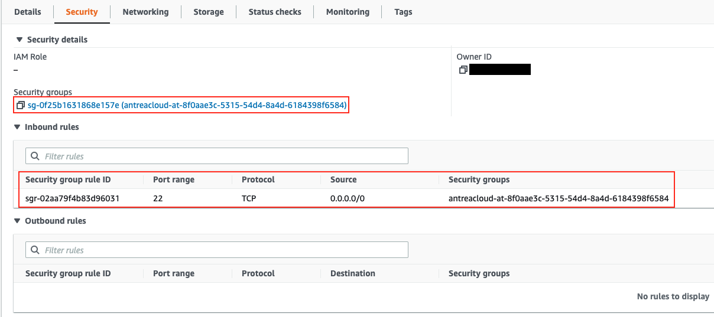

# Getting Started with Nephe 

## Prerequisites

* [kubectl](https://kubernetes.io/docs/tasks/tools/) installed.
* An active Kubernetes cluster, accessible using kubectl.
* [Antrea](https://github.com/antrea-io/antrea/) deployed. Recommend v1.7.
* [cert-manager](https://github.com/jetstack/cert-manager) deployed. Recommend
  v1.8.

## Nephe Installation

### Deploying Nephe in a Kind cluster

Create a Kind cluster. Recommend Kind v0.12.

```bash
./ci/kind/kind-setup.sh create kind
```

Install Nephe.

```bash
kubectl apply -f config/nephe.yml
```

### Deploying Nephe in EKS cluster

To deploy Nephe on an EKS cluster, please refer 
to [the EKS installation guide](eks-installation.md).

### Deploying Nephe in AKS cluster

To deploy Nephe on an AKS cluster, please refer
to [the AKS installation guide](aks-installation.md).

## Importing Cloud VMs

To manage security policies of VMs, we need to first import target VMs onto the
`Nephe Controller`. Below sections sets up access to public cloud account,
select target VMs, and import VMs into the K8s cluster as `VirtualMachine` CRs.

### CloudProviderAccount

To import cloud VMs, user needs to configure a `CloudProviderAccount` CR, with
a K8s secret containing base64 encoded cloud account credentials. The secret
should be created in `nephe-system` namespace so nephe controller can access it.

#### Sample `Secret` for AWS:

To get the base64 encoded json string for credential, run:

```bash
echo '{"accessKeyId": "YOUR_AWS_ACCESS_KEY_ID", "accessKeySecret": "YOUR_AWS_ACCESS_KEY_SECRET", "roleArn": "YOUR_AWS_IAM_ROLE_ARN", "externalId": "IAM_ROLE_EXTERNAL_ID"}' | openssl base64
```

`roleArn` and `externalId` are for role based access on AWS. They can be
removed if the credentials are provided.

```bash
kubectl create namespace sample-ns
cat <<EOF | kubectl apply -f -
apiVersion: v1
kind: Secret
metadata:
  name: aws-account-creds
  namespace: nephe-system
type: Opaque
data:
  credentials: "<BASE64_ENCODED_JSON_STRING>"
``` 

#### Sample `CloudProviderAccount` for AWS:

```bash
kubectl create namespace sample-ns
cat <<EOF | kubectl apply -f -
apiVersion: crd.cloud.antrea.io/v1alpha1
kind: CloudProviderAccount
metadata:
  name: cloudprovideraccount-aws-sample
  namespace: sample-ns
spec:
  awsConfig:
    region: "<REPLACE_ME>"
    secretRef:
      name: aws-account-creds
      namespace: nephe-system
      key: credentials
EOF
``` 

#### Sample `Secret` for Azure:

To get the base64 encoded json string for credential, run:

```bash
echo '{"subscriptionId": "AZURE_SUBSCRIPTION_ID", "clientId": "YOUR_AZURE_CLIENT_ID", \
       "tenantId": "AZURE_TENANT_ID", "clientKey": "YOUR_AZURE_CLIENT_KEY"}' | openssl base64
```

```bash
kubectl create namespace sample-ns
cat <<EOF | kubectl apply -f -
apiVersion: v1
kind: Secret
metadata:
  name: azure-account-creds
  namespace: nephe-system
type: Opaque
data:
  credentials: "<BASE64_ENCODED_JSON_STRING>"
EOF
``` 

#### Sample `CloudProviderAccount` for Azure:

```bash
kubectl create namespace sample-ns
cat <<EOF | kubectl apply -f -
apiVersion: crd.cloud.antrea.io/v1alpha1
kind: CloudProviderAccount
metadata:
  name: cloudprovideraccount-azure-sample
  namespace: sample-ns
spec:
  azureConfig:
    region: "<REPLACE_ME>"
    secretRef:
      name: azure-account-creds
      namespace: nephe-system
      key: credentials
EOF
``` 

### CloudEntitySelector

Once a `CloudProviderAccount` CR is added, virtual machines (VMs) may be
imported in the same Namespace via `CloudEntitySelector` CRD. The below example
selects VMs in VPC `VPC_ID` from `cloudprovideraccount-sample` to import in
`sample-ns` Namespace.

```bash
cat <<EOF | kubectl apply -f -
apiVersion: crd.cloud.antrea.io/v1alpha1
kind: CloudEntitySelector
metadata:
  name: cloudentityselector-sample01
  namespace: sample-ns
spec:
  accountName: cloudprovideraccount-sample
  vmSelector:
      - vpcMatch:
          matchID: "<VPC_ID>"
EOF
``` 

If there are any virtual machines in VPC `VPC_ID`, those virtual machines will
be imported. Invoke kubectl commands to get the details of imported VMs.

```bash
kubectl get virtualmachines -A
kubectl get vm -A
```

```text
# Output
NAMESPACE        NAME                  CLOUD-PROVIDER   VIRTUAL-PRIVATE-CLOUD   STATUS
sample-ns        i-01b09fee2f216c1d7   AWS              vpc-02d3e1e0f15a56f4b   running
sample-ns        i-02a0b61c39cb34e5c   AWS              vpc-02d3e1e0f15a56f4b   running
sample-ns        i-0ae693c487e22dca8   AWS              vpc-02d3e1e0f15a56f4b   running
```

Currently, the following matching criteria are supported to import VMs.

* AWS:
    * vpcMatch: matchID, matchName
    * vmMatch: matchID, matchName
* Azure:
    * vpcMatch: matchID
    * vmMatch: matchID, matchName

### External Entity

For each cloud VM, an `ExternalEntity` CR is created, which can be used to
configure Antrea `NetworkPolicy` (ANP).

```bash
kubectl get externalentities -A
kubectl get ee -A
```

```text
# Output
NAMESPACE   NAME                                 AGE
sample-ns   virtualmachine-i-0033eb4a6c846451d   13m
sample-ns   virtualmachine-i-05e3fb66922d56e0a   13m
sample-ns   virtualmachine-i-0a20bae92ddcdb60b   13m
```

```bash
kubectl describe vm i-0033eb4a6c846451d -n sample-ns
```

```text
# Output
Name:         i-0033eb4a6c846451d
Namespace:    sample-ns
Labels:       <none>
Annotations:  cloud-assigned-id: i-0033eb4a6c846451d
              cloud-assigned-name: vpc-0d6bb6a4a880bd9ad-ubuntu1-kumaranand
              cloud-assigned-vpc-id: vpc-0d6bb6a4a880bd9ad
API Version:  crd.cloud.antrea.io/v1alpha1
Kind:         VirtualMachine
Metadata:
  Creation Timestamp:  2022-08-12T05:34:29Z
  Generation:          1
  Managed Fields:
    API Version:  crd.cloud.antrea.io/v1alpha1
    Fields Type:  FieldsV1
    fieldsV1:
      f:metadata:
        f:annotations:
          .:
          f:cloud-assigned-id:
          f:cloud-assigned-name:
          f:cloud-assigned-vpc-id:
        f:ownerReferences:
          .:
          k:{"uid":"b5b48b74-53bc-4943-836f-9d58a4f245e8"}:
            .:
            f:apiVersion:
            f:blockOwnerDeletion:
            f:controller:
            f:kind:
            f:name:
            f:uid:
      f:status:
        .:
        f:networkInterfaces:
        f:provider:
        f:state:
        f:tags:
          .:
          f:Environment:
          f:Login:
          f:Name:
          f:Terraform:
        f:virtualPrivateCloud:
    Manager:    nephe-controller
    Operation:  Update
    Time:       2022-08-12T05:34:29Z
  Owner References:
    API Version:           crd.cloud.antrea.io/v1alpha1
    Block Owner Deletion:  true
    Controller:            true
    Kind:                  CloudEntitySelector
    Name:                  cloudentityselector-aws
    UID:                   b5b48b74-53bc-4943-836f-9d58a4f245e8
  Resource Version:        378157
  UID:                     acbf686e-b3d3-421c-bd42-37308e7fd060
Status:
  Network Interfaces:
    Ips:
      Address:       10.0.1.173
      Address Type:  InternalIP
      Address:       54.177.32.161
      Address Type:  ExternalIP
    Mac:             02:4c:d7:4a:f4:f3
    Name:            eni-0bef7c10929c98111
  Provider:          AWS
  State:             running
  Tags:
    Environment:          nephe
    Login:                ubuntu
    Name:                 vpc-0d6bb6a4a880bd9ad-ubuntu1-kumaranand
    Terraform:            true
  Virtual Private Cloud:  vpc-0d6bb6a4a880bd9ad
Events:                   <none>
```

## Apply Antrea NetworkPolicy

With the VMs imported into the cluster, we can now configure their security
policies by setting and applying [Antrea NetworkPolicies (ANP)](https://github.com/antrea-io/antrea/blob/main/docs/antrea-network-policy.md)
on them. The policy will be realized with cloud native security groups and
security rules. Please refer to [NetworkPolicy documentation](networkpolicy.md)
for more information on how ANPs are used, translated, and applied.

Cloud VM CRs may be selected in `externalEntitySelectors` under `To`, `From` and
`AppliedTo` fields of the Antrea `NetworkPolicy`.

The below sample ANP allows ssh traffic to all VMs.

```bash
cat <<EOF | kubectl apply -f -
apiVersion: crd.antrea.io/v1alpha1
kind: NetworkPolicy
metadata:
  name: vm-anp
  namespace: sample-ns
spec:
  priority: 1
  appliedTo:
  - externalEntitySelector:
      matchLabels:
         kind.nephe: virtualmachine
  ingress:
  - action: Allow
    from:
      - ipBlock:
          cidr: 0.0.0.0/0
    ports:
      - protocol: TCP
        port: 22

EOF
```

Below shows the security groups on the AWS EC2 console after the above network
policy is applied.



The VirtualMachinePolicy API will display the policy realization status of all
policies being applied to a VM. The ANP status on a virtual machine will be
shown in the `Realization` field. In the below example, `vm-anp` is successfully
applied to all VMs.

```bash
kubectl get virtualmachinepolicy -A
kubectl get vmp -A
```

```text
# Output
NAMESPACE   VM NAME               REALIZATION   COUNT
sample-ns   i-05e3fb66922d56e0a   SUCCESS       1
sample-ns   i-0a20bae92ddcdb60b   SUCCESS       1
sample-ns   i-0033eb4a6c846451d   SUCCESS       1
```

The `externalEntitySelector` field in ANP supports the following pre-defined
labels:

* `kind.nephe`: Select based on CRD type. Currently, only supported
  CRD types is `virtualmachine` in lower case. `virtualmachine` may be used in
  `To`, `From`, `AppliedTo` ANP fields. Thus, an ANP may be applied to virtual
  machines.
* `vpc.nephe`: Select based on cloud resources VPC.
* `name.nephe`: Select based on K8s resource name. The resource name
  is meaningful only within the K8s cluster. For AWS, virtual machine name is
  the AWS VM instance ID. For Azure virtual machine name is the hashed values of
  the Azure VM resource ID.
* `KEY.tag.nephe`: Select based on cloud resource tag key/value pair,
  where KEY is the cloud resource tag key in lower case and label value is cloud
  resource tag value in lower case.
