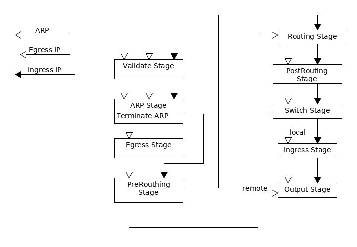

# Network Provider
Network provider is network layer abstraction that offers upper layers to configure
network stack on a platform.

## Design Goads and Philosophies
Network provider is not written for a specific use case, rather it is feature-centric. It provides
a set of network features that each upper layers may selectively use to satisfy its individual
requirements.

Arbitrary networks topologies and combination of feature sets can be generated using simple and
 orthogonal set of APIs provided by this network layer abstraction.

Easy for developers to contribute. Developers should be able to contribute to a feature
development with guide rails, debugging tools, and encapsulation.

## User Interface
The primary function unit of network provider is the switch-router abstraction. A switch-router
can be created or destroyed via,
``` golang
type NetworkProvider interface {
	// Start NetworkProvider process.
	Start()

	// Start reconcile.
	EnableReconcile()

	// Create a bridge. ErrorExist is returned if bridge is already
	// discovered; or is already created.
	CreateBridge(name string) (Bridge, error)

	// Delete a existing bridge.
	DeleteBridge(name string) error

	// List bridges, include discovered bridges that is not created by
	// this network provider.
	ListBridges() []Bridge
}
```

Upper layer may configures various features on each router-switch. The below code segment
describes features, L2, L3, NetworkPolicy, currently implemented by network provider stack. 

 ```golang
type Bridge interface {
	// Gets bridge name.
	GetName() string

	// Attaches a link to bridge. ErrorExist returns if link is already attached.
	AttachLink(link *Link) error

	// Detaches a link from bridge.
	DetachLink(name string) error

	// List of links from runtime, including discovered links not configured by
	// this network provider.
	ListLinks() []Link

	// Connects to another bridge. TDB.
	Connect(brdName string) error

	// Disconnects from another bridge. TDB.
	Disconnect(brdName string) error

	// List of connected bridges, including discovered bridges not configured by
	// this network provider. TDB.
	ListConnectedBridges() []string

	// Features.
	Router
	NetworkPolicyEnforcer
}

type Router interface {
	// Add an existing link as gateway to receive traffic.
	AddGateway(gw string) error

	// Deleting an existing link as gateway to receive traffic.
	DeleteGateway(gw string) error

	// AddRoute adds route to non-local destination. if nh is provided.
	// If nh is not provided, route is for local destination.
	AddRoute(link string, dst net.IPNet, nh *NextHop) error

	// DeleteRoute delete route for non-local traffic.
	DeleteRoute(link string, dst net.IPNet) error
}

type NetworkPolicyEnforcer interface {
	// Adds an network policy rule.
	AddNetworkPolicyRule(rule *Rule) error

	// Deletes an betwork policy rule. 
	DeleteNetworkPolicyRule(ruleID uint32) error
	
	// Adds an applied-to to a rule.
	AddNetworkPolicyRuleAppliedTo(ruleID uint32, isIngress bool, ips []net.IPNet) error

	// Deletes an applied-to from a rule.
	DeleteNetworkPolicyRuleAppliedTo(ruleID uint32, isIngress bool, ips []net.IPNet) error
	
	// Gets counters for all rules.
	GetRuleCounters() []RuleCounter
	
	// Get realization status for all rules.
	GetRuleStatus() []RuleStatus
}
``` 

A network provider router-switch is not much different from a physical switch
-router. It routes packets if the destination MAC addresses lands out its router ports' MACs, and
switches the packets otherwise. The upper layer may enable selective features on each
individual switch-router at its creation, and may inter-connect multiple switch-router to realize
arbitrary network topologies. For instance, on one switch-router, upper layer may choose to
 enable switching only, and on another switch-router, it elects to enable both routing and
 switching.  

At present, VM agent is the only upper layer user, therefore network provider switch-router
supports only relevant features L2, L3, and network policy features.

## Internal Design

Internally network provider stack consists of two tiers: network provider tier, 
and executor tier.

### Network Provider Tier
The network provider tier performs the following tasks:
- Provides the platform agnostic APIs to upper layer to call and configure network stack as
described in the previous section.
- Allows lower, platform and implementation specific, executor tier to register with it, and to
forward network configuration requests to executor tier.
- Provides configuration storage to executor tier, and provide mechanism to reconcile
 intent and runtime configurations.
- Provides save/restore schematics that allows network provider stack to operate in the headless
 mode.
- Guarantees all calls into executor layer is from the same thread, therefore executor tier itself
 requires no synchronization handling. 

```golang
type BridgeBackend interface {
	// Generic functions
	// Save configuration.
	SaveConfig() error

	// List runtime configuration objects.
	ListConfigObjs() []BackendCfgObject
	// Update runtime configuration objects.
	UpdateConfigObjs(added, updated, removed []BackendCfgObject) error

	SetConfigCache(cache cache.Indexer) error

	// Bridge functions.
	// Backend implementation may choose to delay configuration change until
	// reconcile. This may be useful for batch operations
	AttachLink(link *Link) (delayed bool, err error)
	DetachLink(link string) (delayed bool, err error)
	Connect(brdName string) (delayed bool, err error)
	Disconnect(brdName string) (delayed bool, err error)
	ListLinks() []Link
	ListConnectedBridges() []string
}
```

The above code segment is the interface returned on router-switch creation by executor
tier that captures, in addition to switching aspect of switch-router, common APIs to manipulate
general configurations on the switch-router.  
The network provider tier uses these common configuration APIs to reconcile
configuration intention with runtime on the switch-router, and to support headless mode.   

### OVS Executor
The network provider implements OVS in executor tier. Each network provider switch-router is
realized as an OVS bridge in OVS executor tier. 

Depending on switch-router creation request, the OVS bridge may be 
1. an unmanaged bridge, on which no flows are configured, and bridge act like a standard Linux
bridge. Upper layer may wish to configure un-managed bridge as transport bridge to work in
conjunction with a managed bridge.
1. a managed bridge that uses flows to control traffic as if it is switched. In this mode, the
 OVS bridge runs a pipeline that implementing switching only. VM agent uses this mode.
1. a managed bridge that uses flows to control traffic as if it is switched or routed.
In this mode, the OVS bridge runs a pipeline that implements both switching and routing.

#### Pipeline
The OVS executor pipeline draws inspections from IPTable architecture. 

IPTables have some pre-defined stages/chains, the traversal order to these chains by an IP packet
is pre-determined and cannot be changed. 
A feature may define and insert its own set rules and/or chains into these pre-defined chains. IP
tables implementation guarantees a packet traverses from rule to rule and chain to chain
without skipping. This allows each user develops its own set of rules and chains without
the need to know the rules/chains from other features.

Similar to IPTables, an OVS pipeline pre-defines packet process stages as shown. Each stage contains
zero or more tables. The actual tables in each stage is specific to a pipeline request, and may
 vary from pipeline to pipeline depending on requirements. Packets must, with
 few exceptions, traverse from one table to the next, and order cannot be
altered.


Based on switch-router requirement from upper layer, an OVS bridge chooses one pipeline
to use. 

A pipeline completely describes packet processing flows of an associated OVS bridge. It contains
tables along with its feature in each stage. To facilitate feature isolation, each table may only
have one feature owner. In addition, any resources
registers, ConnTrack Marks required features are also specified in the pipeline.  

The table ID and other resources are computed at runtime.

The following code segment represents OVS pipeline that implements a
 switch.
```golang
	basicPipelineRequest = ofPipelineRequest{
		Registers: []ofRegRequest{
			{Name: fwOutputReg, ByteSize: fwOutputRegSize},
			{Name: fwInPortReg, ByteSize: fwInPortRegSize},
			{Name: fwClassifierReg, ByteSize: fwClassifierRegSize},
		},

		Tables: map[pipelineStage][]ofTableRequest{
			validationPipelineStage: {
				{Name: fwClassifierTable, Feature: fwFeature}, // must always be the first table in pipeline.
				{Name: fwValidateTable, Feature: fwFeature},
			},
			arpPipelineStage: {
				{Name: fwARPTable, Feature: fwFeature},
				{Name: fwARPStageBranchTable, Feature: fwFeature},
			},
			egressPipelineStage: {},
			preroutePipelineStage: {
				{Name: fwPreRouteStageBranchTable, Feature: fwFeature},
			},
			routePipelineStage:     {},
			postroutePipelineStage: {},
			switchPipelineStage: {
				{Name: fwSwitchTable, Feature: fwFeature}, // Last ofTable in stage.
			},
			ingressPipelineStage: {
				{Name: fwIngressStageBranchTable, Feature: fwFeature},
			},
			outputPipelineStage: {
				{Name: fwOutputTable, Feature: fwFeature}, // Last ofTable in stage.
			},
		},
	}
```    

The following code segment defines a pipeline implements a switch with network policy feature.
```golang
npL2PipelineRequest = ofPipelineRequest{
		Registers: []ofRegRequest{
			{Name: fwOutputReg, ByteSize: fwOutputRegSize},
			{Name: fwInPortReg, ByteSize: fwInPortRegSize},
			{Name: fwClassifierReg, ByteSize: fwClassifierRegSize},
			{Name: conjunctionIDReg, ByteSize: conjunctionIDRegSize},
			{Name: statsUserReg, ByteSize: statsUserRegSize},
		},

		ConnMarks: []ofConnTrackRequest{
			{Name: npEgressConnMark, ConnMarkBitSize: 1, Feature: npFeature},
			{Name: npIngressConnMark, ConnMarkBitSize: 1, Feature: npFeature},
		},
		Tables: map[pipelineStage][]ofTableRequest{
			validationPipelineStage: {
				{Name: fwClassifierTable, Feature: fwFeature}, // must always be the first table in pipeline.
				{Name: fwValidateTable, Feature: fwFeature},
			},
			arpPipelineStage: {
				{Name: fwARPTable, Feature: fwFeature},
				{Name: fwARPStageBranchTable, Feature: fwFeature},
			},
			egressPipelineStage: {
				{Name: npIngressReplyTable, Feature: npFeature},
				{Name: npEgressTable, Feature: npFeature},
			},
			preroutePipelineStage: {
				{Name: fwPreRouteStageBranchTable, Feature: fwFeature},
			},
			routePipelineStage:     {},
			postroutePipelineStage: {},
			switchPipelineStage: {
				{Name: fwSwitchTable, Feature: fwFeature}, // Last ofTable in stage.
			},
			ingressPipelineStage: {
				{Name: fwIngressStageBranchTable, Feature: fwFeature},
				{Name: npEgressReplyTable, Feature: npFeature},
				{Name: npIngressTable, Feature: npFeature},
			},
			outputPipelineStage: {
				{Name: fwOutputTable, Feature: fwFeature}, // Last ofTable in stage.
			},
		},
	}
```

### OVS Feature Struct
To facilitate feature isolation, the OVS executor provides a `feature` struct, that provides
 constrained access to tables, register, etc that are computed at runtime, are only declared for
 that feature. It also provide general functions to send down flows, send and receive packets 
 to/from the OVS.

An OVS feature represents one aspect of network functionality that is written orthogonal
to other OVS features. For instance, in the above `npL2PipelineRequest` code segments tables
managed by network policy feature (npFeature) and switch feature (fwFeature) are developed
independently, oblivious of tables, registers, or any other resources used by the other features.

 
Common functionalities are proviced as feature decorators. Currently connection tracking and stats
are decorators implemented to allow any feature to create conjunction based connection tracking
 flows, and stats collection flows.
For instance the below code segment is declaration of network policy feature that make use of 
 stats and connection tracking decorators.
```golang
type ofFeatureNetworkPolicy struct {
	ofFeature
	connTrack         *ofFeatureConnTrackable
	stat              *ofFeatureStatsCollector
	requests          map[uint32]*ofConnTrackFlowRequest
	egressStatsUsrID  uint8
	ingressStatsUsrID uint8
}

func newOfFeatureNetworkPolicy(b *bridge) *ofFeatureNetworkPolicy {
	feature := &ofFeatureNetworkPolicy{
		ofFeature: ofFeature{name: npFeature, bridge: b}}
	feature.connTrack = newOfFeatureConnTrackable(&feature.ofFeature, feature)
	feature.stat = newofFeatureStatsCollector(&feature.ofFeature)
	feature.requests = make(map[uint32]*ofConnTrackFlowRequest)
	return feature
}
``` 

### Feature Developer Work Flow

When developing a new_feature, developer may follow the these steps. 

1. Creates a file of_new_feature.go, this file contains all flow implementations specific to
 new_feature.
1. Decides the tables, registers bits, ConnMarks bits that this new feature may require, and declare
them in of_new_feature.go
1. Decides the placements of new_feature's table on an existing pipeline or new pipeline and, 
modify accordingly in of_pipeline_request_linux.go.
1. Implements the flows in of_new_feature.go using methods exposed by `feature` struct.
1. If necessary, expose this new feature and methods to network provider tier.
1. Creates a file ovs_new_feature.go that implements backend methods exposed by network provider
 tier. It typically does sanity check,  ensures the pipeline supports the new_feature and then
 calling into flow methods in of_new_feature.go 

Note the above work flow requires developer to solely focus on designing of flows to support a
feature,  facilitate speedy and quality feature development. It frees her/him from:
- Understanding packet traverse order of a pipeline to avoid feature flows from being bypassed.
- Knowing priority and registers used by other features to avoid conflict.
- Handling of flows downloading failures and subsequent reconcile.
- Flow download performance, responsiveness vs scalability.
- Configuration storage synchronization.

#### Annotation
The OVS executor used flow annotation to help developer identify flows quickly in live debugging
session. Each flow annotation consists of Feature:TableName:ConfigKind:ConfigInstance. For
instance, developer may show all the flows associated with a network policy rule 1.

```bash
root@4bacc2a8e8a0:/usr/src/antrea.io/antreacloud/pkg/vmagent/networkprovider/executors/ovs# ovs-ofctl dump-flows test-br | ovs-note-decode | grep -a -i "RULE" | grep -a -i ":1"
 cookie=0xbe9a45b58d16b076, duration=283.242s, table=5, n_packets=4, n_bytes=392, idle_age=280, priority=65525,ct_state=+est-rpl,ct_mark=0x1/0x1,ip,reg2=0x1 actions=load:0x1->NXM_NX_REG3[0..7],resubmit(,245),load:0->NXM_NX_REG2[],note:NETWORKPOLICY:NP_EGRESS:NP_EGRESS_RULE:1,resubmit(,6)
 cookie=0x9bb455a5f78e6c0d, duration=283.242s, table=5, n_packets=1, n_bytes=98, idle_age=281, priority=65524,ct_state=-rel-rpl+trk,ip,reg2=0x1 actions=load:0x1->NXM_NX_REG3[0..7],resubmit(,245),load:0->NXM_NX_REG2[],ct(commit,table=6,zone=65534,exec(load:0x1->NXM_NX_CT_MARK[0])),note:NETWORKPOLICY:NP_EGRESS:NP_EGRESS_RULE:1
 cookie=0x68f4cbfda6c77d73, duration=283.242s, table=5, n_packets=0, n_bytes=0, idle_age=283, priority=256,icmp,nw_src=20.20.20.1 actions=conjunction(1,1/2),note:NETWORKPOLICY:NP_EGRESS:NP_EGRESS_RULE:1
 cookie=0xa91fb835894ee8e8, duration=283.242s, table=5, n_packets=0, n_bytes=0, idle_age=283, priority=256,icmp,nw_dst=30.30.30.1 actions=conjunction(1,2/2),note:NETWORKPOLICY:NP_EGRESS:NP_EGRESS_RULE:1
 cookie=0xcd56cbbf958c1171, duration=283.242s, table=5, n_packets=5, n_bytes=490, idle_age=280, priority=256,conj_id=1,ip,reg2=0 actions=load:0x1->NXM_NX_REG2[],ct(table=5,zone=65534),note:NETWORKPOLICY:NP_EGRESS:NP_EGRESS_RULE:1
 cookie=0xc9fc26ac5f0d2ba3, duration=283.242s, table=9, n_packets=5, n_bytes=490, idle_age=280, priority=65525,ct_state=+est+rpl,ct_mark=0x1/0x1,ip,reg2=0x1 actions=load:0x1->NXM_NX_REG3[0..7],resubmit(,245),load:0->NXM_NX_REG2[],note:NETWORKPOLICY:NP_EGRESS:NP_EGRESS_RULE:1,resubmit(,10)
 cookie=0x34ffadbf928a8185, duration=283.242s, table=9, n_packets=0, n_bytes=0, idle_age=283, priority=256,icmp,nw_src=30.30.30.1 actions=conjunction(1,1/2),note:NETWORKPOLICY:NP_EGRESS:NP_EGRESS_RULE:1
 cookie=0x7fe68b97c07840a2, duration=283.242s, table=9, n_packets=0, n_bytes=0, idle_age=283, priority=256,icmp,nw_dst=20.20.20.1 actions=conjunction(1,2/2),note:NETWORKPOLICY:NP_EGRESS:NP_EGRESS_RULE:1
 cookie=0x50df35ff9fcb2340, duration=283.242s, table=9, n_packets=5, n_bytes=490, idle_age=280, priority=256,conj_id=1,ip,reg2=0 actions=load:0x1->NXM_NX_REG2[],ct(table=9,zone=65534),note:NETWORKPOLICY:NP_EGRESS:NP_EGRESS_RULE:1
 cookie=0xc3f9dccd7717211f, duration=283.242s, table=245, n_packets=10, n_bytes=980, idle_age=280, priority=256,ip,reg2=0x1,reg3=0x1/0xff actions=note:UTIL_STATS:NP_EGRESS_RULE:STATS_ALLOW:1
```

    
    


  
     

      
  


