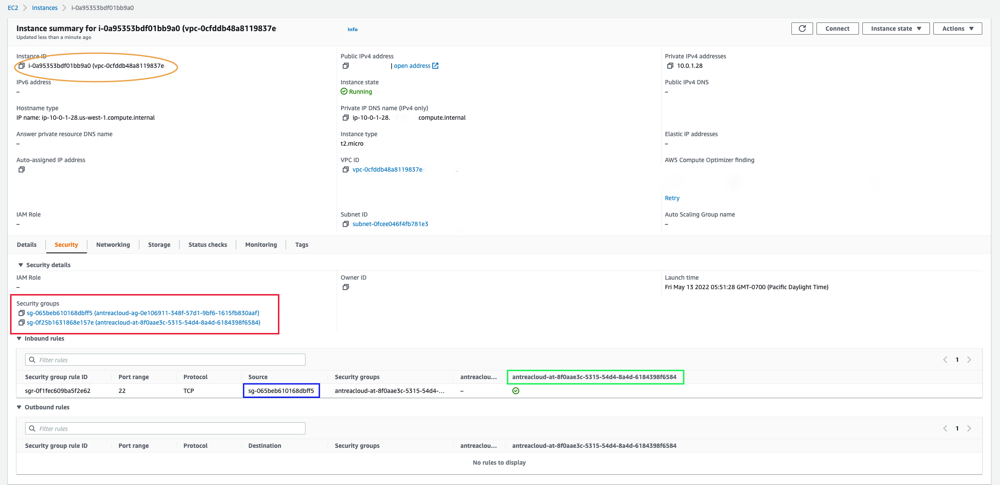

# Nephe NetworkPolicy

The Nephe project does not consume the Antrea NetworkPolicy(ANP) resource
directly. The ANP object is used by [Antrea](https://antrea.io/) project, where
`antrea-controller` Pod watches for the Antrea NetworkPolicy(ANP) objects and
converts each ANP object to an Antrea internal [NetworkPolicy](https://github.com/antrea-io/antrea/blob/main/pkg/apis/controlplane/v1beta2/types.go#L202)
object for further processing. This Antrea internal `NetworkPolicy` object
will be used by the Nephe Controller to enforce the network policies on public
cloud virtual machines.

The `nephe-controller` registers with the antrea `API server`, to receive all
the events related to `AddressGroups`, `AppliedToGroups` and
`NetworkPolicies` objects. The `nephe-controller` translates these
NetworkPolicy related objects to the corresponding cloud constructs. Each antrea
internal `NetworkPolicy` object will result in a combination of one
or more cloud network security groups(NSG). The `AddressGroups` field will be
translated to a cloud NSG, and it will be embedded in `source/destination` field
of a cloud network security rule. The `AppliedToGroups` will translated to a
NSG, and it will be attached to the public cloud VMs. Currently, enforcing ANP
is only supported on AWS and Azure clouds.

## Introduction

This section gives a brief introduction about cloud network security groups and
Antrea Network Policy object. These two concepts are the basics to
understand how `nephe-controller` realizes network polices on public cloud
VMs. If you are already familiar with these two concepts, please skip this
section and proceed to the [Implementation](#implementation) section.

### Antrea Network Policy

Each Antrea internal `NetworkPolicy` object contains a `Name` and `Namespace`
field that uniquely identifies an Antrea internal `NetworkPolicy` object. 
Name and Namespace corresponds to user facing Antrea Network Policy(ANP). It
contains list of rules and a list of references to the appliedToGroups. 
Each rule contains,
- A direction field.
- A list of services(port).
- To/From field - IPBlock and reference to a list `AddressGroups`.

An `AddressGroup` is used in `To/From` field of an ANP Rule. Each 
`AddressGroup` contains the following:
- An auto-generated name, which uniquely identifies an `AdressGroup`.
- A list of GroupMembers, each may contain references of ExternalEntities if
  applicable.
- A list of Endpoint, each contains IP address and ports.

An `AppliedToGroup` is used in `AppliedTo` field of an ANP. Each `AppliedToGroup`
contains the following:
- An auto-generated name(namespace-less) uniquely identifies a `AppliedToGroup`.
- A list of GroupMembers, each may contain references of ExternalEntities if
  applicable.
- A list of Endpoints, each contains IP address and ports.

### Network Security Group

A Network Security Group(NSG) is a whitelist, which is at a VPC level. It is
uniquely identified by its name or an ID. It contains zero or more Network
Interface Cards(NIC). A NIC may be associated with zero or more NSGs. A NSG
contains Ingress and Egress rules.

**An Ingress Rule includes**:
- IPBlocks - a list of source IP blocks of the permitted incoming traffic.
- Ports - a list of source ports of the permitted incoming traffic.
- SecurityGroups - a list of securityGroups from which incoming traffic is
  permitted.

**An Egress Rule includes**:
- IPBlocks - a list of destination IP blocks of the permitted outgoing traffic.
- Ports - a list of destination ports of the permitted outgoing traffic.
- SecurityGroups - a list of securityGroups to which outgoing traffic is
  permitted.

## Implementation 

The Nephe Controller creates two types of network security groups(NSGs) to
enforce network polices on public cloud VMs, which are called as
`AddressGroup NSG` and `AppliedTo NSG`. An Antrea internal `NetworkPolicy` is
realized on the cloud VMs via a combination of `AddressGroup NSG` and
`AppliedTo NSG`. For better performance/scalability, all cloud calls to manage
antrea created NSGs are designed to be asynchronous.

### AddressGroup NSG 

This NSG internally is referred to as cloud membership only security group, as
it contains only the GroupMembers. This type of NSG is created with a prefix
`nephe-ag-adressgroupname`, where the prefix `ag-` implies it is just
an `AddressGroup` based NSG. 

- Each Antrea AddressGroup is mapped to zero or more cloud membership only
`AddressGroup NSG`, and zero or more IP blocks. 
- Each `AddressGroup NSG`, correspond to a VPC, and a list of cloud resources,
  which will not have ingress/egress rules.

### AppliedTo NSG

This NSG will be applied to the public cloud VMs. This type of NSG is created
with a prefix `nephe-at-appliedtogroupname`, where the prefix `at-`
implies it is an `AppliedTo` based NSG.

- Each Antrea AppliedGroup is mapped to zero or more cloud `AppliedTo NSG`
- Each `AppliedTo NSG` correspond to a VPC and a list of cloud resources, which
  will have ingress/egress rules associated with it.

### Mapping Antrea Network Policy To NSG

Each `AddressGroup NSG` and IPBlocks uniquely maps `To/From` fields in the user
configured Antrea Network Policy. Each `AppliedTo NSG` uniquely maps to an 
`AppliedTo` field in the Antrea Network Policy. Each `AppliedTo NSG` creates
ingress and egress rules based on cloud membership only `AddressGroup NSG` and
IPBlocks associated with an Antrea Network Policy.

### ANP Rule realization

It is desirable to show what Antrea Network Policies are associated with a
specific cloud resource and the Antrea Network Policies realization status. 
Each cloud resource shall keep track of cloud `AppliedTo NSG` it is
associated with. The union of Antrea Network Policies associated with these cloud
`AppliedTo NSG`, is entirety of the NetworkPolicies intended to this
network resource. An Antrea NetworkPolicy is considered to be successfully
applied to a network resource, when the following expectations are met.
- Its `AppliedTo NSG` to which the network resource is a member of,
  are created/updated with no error.
- Its `AddressGroup NSG` are created/updated with no error.

## Illustration with an Example

In this example, AWS cloud is configured using Cloud Provider Account(CPA) and
the cloud resource filter is configured using Cloud Entity Selector(CES) to
import 3 VMs that belong to vpc `vpc-0cfddb48a8119837e`.

### List Virtual Machines

The following kubectl command can be used to retrieve VirtualMachine resources
that are imported:

```bash
kubectl get virtualmachines -A
kubectl get vm -A
```

```text
# Output
NAMESPACE   NAME                  CLOUD-PROVIDER   VIRTUAL-PRIVATE-CLOUD   STATUS
sample-ns   i-049076f0e26bb1515   AWS              vpc-0cfddb48a8119837e   running
sample-ns   i-092142399d95fa775   AWS              vpc-0cfddb48a8119837e   running
sample-ns   i-0a95353bdf01bb9a0   AWS              vpc-0cfddb48a8119837e   running
```

### List External Entities

The following kubectl command can be used to retrieve ExternalEntity resources
corresponding to each VM:

```bash
kubectl get externalentities -A
kubectl get ee -A

```

```text
# Output
NAMESPACE   NAME                                 AGE
sample-ns   virtualmachine-i-049076f0e26bb1515   68m
sample-ns   virtualmachine-i-092142399d95fa775   68m
sample-ns   virtualmachine-i-0a95353bdf01bb9a0   68m
```

### Create a sample Antrea Network Policy

A sample AntreaNetworkPolicy is shown below, which specifies an Ingress rule
allowing TCP traffic on port 22. The `from` field is an `externalEntitySelector`
with matching labels as `name.crd.cloud.antrea.io: i-0a95353bdf01bb9a0`.
And the `appliedTo` field is an `externalEntitySelector` with a matching
label as `kind.crd.cloud.antrea.io: virtualmachine`. 

```bash
# Add Policy to Allow SSH
apiVersion: crd.antrea.io/v1alpha1
kind: NetworkPolicy
metadata:
  name: vm-anp
  namespace: sample-ns
spec:
  priority: 1
  appliedTo:
  - externalEntitySelector:
      matchLabels:
        kind.nephe: virtualmachine
    ingress:
    - action: Allow
      from:
      - externalEntitySelector:
          matchLabels:
            name.nephe: i-0a95353bdf01bb9a0
      ports:
      - protocol: TCP
        port: 22
```

### Mapping Antrea Network Policy To NSG

The `nephe-controller` converts the example ANP into a combination of
`AddressGroup NSG` and `AppliedTo NSG` and attaches the NSGs to the respective
VMs, as shown in the below image.



### AddressGroup NSG

The AddressGroup `0e106911-348f-57d1-9bf6-1615fb830aaf` corresponds to the 
`from` field of ANP. This group contains only one ExternalEntity as the Group
Members. The `nephe-controller` will convert this AddressGroup into an 
`AddressGroup NSG` with NSG name as
`nephe-ag-0e106911-348f-57d1-9bf6-1615fb830aaf`.

```bash
kubectl describe addressgroups 0e106911-348f-57d1-9bf6-1615fb830aaf
```

```text
# Output
Name:         0e106911-348f-57d1-9bf6-1615fb830aaf
Namespace:    
Labels:       <none>
Annotations:  <none>
API Version:  controlplane.antrea.io/v1beta2
Group Members:
  External Entity:
    Name:       virtualmachine-i-0a95353bdf01bb9a0
    Namespace:  sample-ns
  Ips:
    AAAAAAAAAAAAAP//CgABHA==
    AAAAAAAAAAAAAP//NsFVLQ==
Kind:  AddressGroup
Metadata:
  Creation Timestamp:  <nil>
  UID:                 0e106911-348f-57d1-9bf6-1615fb830aaf
Events:                <none>
```

### AppliedToGroup NSG

The AppliedToGroup `8f0aae3c-5315-54d4-8a4d-6184398f6584` corresponds to the
`appliedTo` field of the ANP. This group contains all the 3 ExternalEntity as
the Group Members. The `nephe-controller` will convert this AppliedToGroup into
an `AppliedTo NSG` with NSG name as
`nephe-at-8f0aae3c-5315-54d4-8a4d-6184398f6584` and it will attach this
NSG to all the 3 VMs.

```bash
kubectl describe appliedtogroups 8f0aae3c-5315-54d4-8a4d-6184398f6584
```

```text
# Output
Name:         8f0aae3c-5315-54d4-8a4d-6184398f6584
Namespace:    
Labels:       <none>
Annotations:  <none>
API Version:  controlplane.antrea.io/v1beta2
Group Members:
  External Entity:
    Name:       virtualmachine-i-0a95353bdf01bb9a0
    Namespace:  sample-ns
  Ips:
    AAAAAAAAAAAAAP//CgABHA==
    AAAAAAAAAAAAAP//NsFVLQ==
  External Entity:
    Name:       virtualmachine-i-092142399d95fa775
    Namespace:  sample-ns
  Ips:
    AAAAAAAAAAAAAP//CgAB3Q==
    AAAAAAAAAAAAAP//DTm6HQ==
  External Entity:
    Name:       virtualmachine-i-049076f0e26bb1515
    Namespace:  sample-ns
  Ips:
    AAAAAAAAAAAAAP//CgABqg==
    AAAAAAAAAAAAAP//DTj3BQ==
Kind:  AppliedToGroup
Metadata:
  Creation Timestamp:  <nil>
  UID:                 8f0aae3c-5315-54d4-8a4d-6184398f6584
Events:                <none>
```

### Verify ANP Rule realization on VM

The following kubectl command can be used to retrieve VirtualMachinePolicy
resources, which shows the ANP rules realization on each VM.

```bash
kubectl get vmp -A
kubectl get virtualmachinepolicy -A
```

```text
# Output
NAMESPACE   VM NAME               REALIZATION   COUNT
sample-ns   i-092142399d95fa775   SUCCESS       1
sample-ns   i-049076f0e26bb1515   SUCCESS       1
sample-ns   i-0a95353bdf01bb9a0   SUCCESS       1
```

