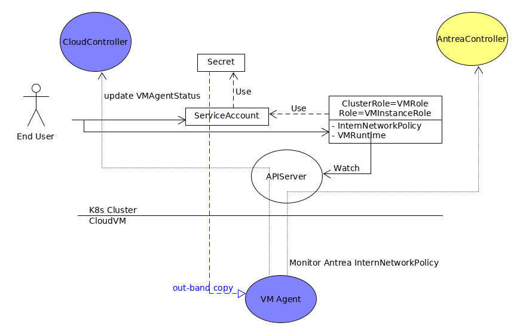
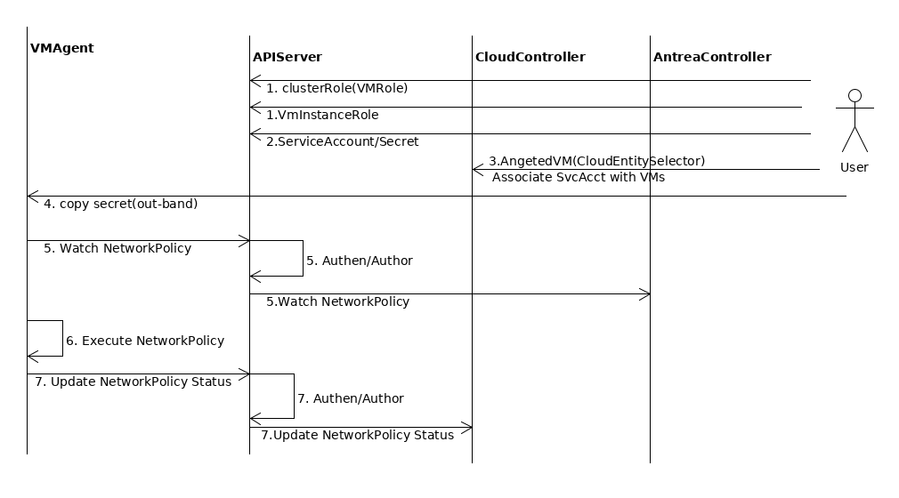
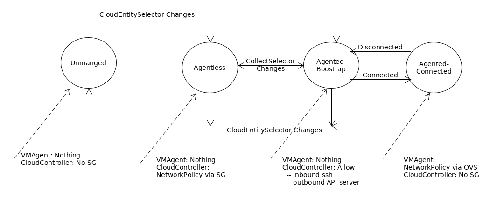
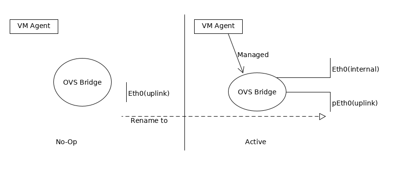
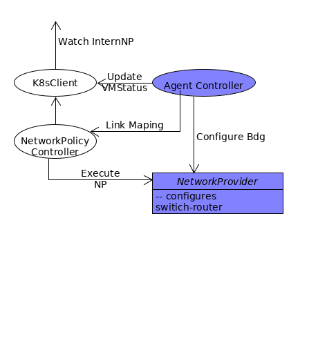

# VM Agent Design

## Feature Requirements
1. Applying NetworkPolicy via VM agent and Open vSwitch, in lieu of cloud specific Security Group.
1. VM agents' accesses to Antrea Plus controllers are secure.
1. User configures via K8s APIServer to manage agented or agentless VMs.
1. NetworkPolicy status on the VM can be retrieved via K8s APIServer.
1. NetworkPolicy statistics may be retrieved. (TBD)

## Constraints and Assumptions
- VM agent life cycle management, such as install, upgrade, is out-band. VM must already have
installed Antrea Plus VM Agent and Open vSwitch in order to run agented mode. The reasons
that Antrea Plus delegates VM agent life cycle management to its operating environments are:
  - There are many OSs and cloud providers, therefore many variations in VM agent installation.
  - Operating environment most likely has simpler/native solution to install and
    upgrade software packages.
  - Antrea Plus VM agents communicate with Antrea Plus Controller cluster via K8s CRD, strict
   version match between agents and controllers are not necessary.
- VMs and Antrea Plus Controller cluster must reside on the same network domain, and reachable
via private/internal IP addresses. For instance, we cannot have on-premise Antrea Plus
controller cluster manages AWS VMs.
  - Antrea Plus has this limitation because 
    - Antrea VM agent (client) to Antrea Plus Controller cluster(server) communication model.
    - An enterprise may prohibit opening service port on public traffic. 
  - This limitation can be circumvented via out-band solutions. For instance in above
  on-premise to AWS VPC example, a VPN connection can be established from on-premise to AWS VPC,
  and VMs on this VPC are able to "directly" connect to K8s API server. 

## Overview



The above diagram provides an overview of agented VM working in concert with Antrea Plus controller
cluster to achieve secured NetworkPolicy distribution.
- A clusterRole VMRole that gives permission to Watch/Get Antrea internal NetworkPolicies. 
- Antrea Controller acts as aggregated APIServer for Antrea internal NetworkPolicy, Cloud
Controller acts as aggregated APIServer for VirtualMachineRuntimeInfo.
- Each agented VM (via CloudEntitySelector not shown) is associated with a ServiceAccount, and a
VMInstanceRole that permits update/create of VirtualMachineRuntimeInfo resource of this VM. The
ServiceAccount is bound to the VMRole as well as VMInstanceRole.
- K8s APIServer acts as gatekeeper, allowing only requests from configured agented VM to reach
Cloud controller and Antrea controller.
- VM agent which cannot reach Cloud controller and Antrea controller shall not enforce
NetworkPolicy.

### WorkFlow



The above diagram illustrates a typical workflow with VM agent enforcing NetworkPolicies.

1. User creates a clusterRole VMRole. This ClusterRole grants watch permissions to
Antrea internal NetworkPolicies.
1. user create a Role VMInstanceRole. This role grands permission with update VMRuntimeInfo CRD.
1. User creates a ServiceAccount and associates this ServiceAccount to roles VMRole and
VMInstanceRole.
1. *The Secret of ServiceAccount needs to be copied to VM out-band*.
1. Cloud controller imports agented VM in way of CloudEntitySelector, that also associated VM
 with ServiceAccount created above.
1. VM agent now has Watch permission for Antrea internal NetworkPolicies.
   - VM agent requests Watch Antrea internal NetworkPolicies to K8s APIServer.
   - K8s APIServer granted VM's request because of step 1, 3, 4 and 5.
   - As Antrea internal NetworkPolicies are backed by aggregated APIServer/Antrea controller, K8s
    APIServer forward the Watch request to Antrea controller.
1. VM agent receives Antrea internal NetworkPolicies from Antrea controller, and it enforces them.
1. VM agent updates VirtualMachineStatus to Cloud controller with VMRuntimeInfo because it is
 granted permissions in steps 2, 3, 4 and 5.

### Considerations

#### ServiceAccount Creation

Antrea Plus currently requires users to pre-create ServiceAccount, and later user must
associated this ServiceAccount with VM via ExternalEntitySelector.

In the future, it may also be possible that a unique ServiceAccount and VMInstanceRole is
automatically created by Cloud Controller for each imported VM.     
   
#### ServiceAccount Secret Transfer
The transfer of ServiceAccount secret to VMs are environment specific and not supported by Antrea
 Plus implementation.

On AWS, it may work as follows for auto-scaled VMs, (insecure user-data is visible to account
 users.)
1.  ServiceAccount is created for auto-scaled VMs.
1.  The ServiceAccount secret is given to VM user/admin.
1.  The VM user/admin configures user-data of VM instance, that includes copy of
ServiceAccount secret to VM.

#### Scalability
[K8s](https://kubernetes.io/docs/setup/best-practices/cluster-large/) claims to support up to 5000 
worker node. In worst-case scenario if we assume that the bottleneck is due to number of connections
from the worker nodes to API server, Antrea plus aims to support up-to 5000 VMs per cluster.

TODO: Need to find out Antrea plus can handle 5000 VMs with acceptable response time.    

Note: Scale out Antrea plus cloud controller has not been considered yet. It may be in the future
depending on scale numbers.

#### Disconnected Agent  

When agent is disconnected from K8s cluster, it could mean that
1. VM is no longer managed by Antrea plus, in this case agent should extract itself from data path
, and allow pre-existing host network to take over.
1. A transient network issue, in this case agent should keep network and policy
 configurations un-changed.
 
Cloud controller provides a clue to the agent to distinguish former from the latter. When an
agented VM is not managed by Antrea Plus, the cloud controller shall first explicitly inform the
agent by updating VirtualMachine CRD this VM as agent-less and allow times for this update to be
propagated to agent.

## Design

### VM state



As shown during its life cycle, a VM may be in one of the following states. 
- Un-manged: In this state, VM agent may or may not have been installed. VM agent takes no action
, and cloud controller ensures no security group(s) as result of NetworkPolicies are
configured for the VM. VM transitions into this state from Agentless, Agented-Bootstrap, Agented
-Connected states or out of this state to Agentless, Agented-Bootstrap states via
CloudEntitySelector changes.

- Agentless: In this state, VM agent may or may not have been installed. VM agent takes no action
, and cloud controller executes NetworkPolicies via security group(s). VM transitions into or out
of this state via CloudEntitySelector.
 
- Agented-Bootstrap: In this state, VM agent must have been installed and running.
VM agent takes no actions,
and cloud controller install minimal security groups only allowing VM communicate with APIServer,
and to be SSHed into for debugging purpose. From this state, VM may transition to Un-managed and
Agentless via CloudEntitySelector. More likely, VM will transition to Agented-Connected state
when VM agent connects to VMManager via K8s APIServer.

- Agented-Connected: In this state, VM agent must have been installed and running.
VM agent executes NetworkPolicies via Open vSwitch flows, and cloud controller installs no
security groups. From this state, VM may transition to Un-managed and Agentless via
CloudEntitySelector. When VM fails to connect to VMManager, it transitions to Agented-Bootstrap
state.

This VM state transition flow allows:
- Simple user interface: VM can be configured to run agentless, agented via choice of
CloudEntitySelector.
- Some measures of fault tolerance and security in agented VM: VM cannot bypass NetworkPolicy
because agent cannot connect to API Server, or VM user stops agent.   

### VirtualMachineRuntimeInfo

VirtualMachineRuntimeInfo is an internal CRD originated from VM agent periodically,and received by
VMManager in cloud controller as an aggregated API server. Its purpose is to report the
liveliness of agent to Cloud controller.

```golang

type VirtualMachineRuntimeInfo struct {
	// AgentState is VM agent state.
	AgentState v1alpha1.VMAgentState `json:"agentState,omitempty"`
	// OS is VM OS.
	OS string `json:"os,omitempty"`
	// AgentVersion is agent version.
	AgentVersion    string            `json:"agentVersion,omitempty"`
	NetworkPolicies map[string]string `json:"networkPolicies,omitempty"`
}
```

### VMManager
VMManger sits inside Cloud controller, it is responsible to manage VM state:

- For each agented VM, modify associated VMInstanceRole so that VM agent may update
 VirtualMachineRuntimeInfo.
- Implements aggregated APIServer for in-memory CRD VirtualMachineRuntimeInfo.
- Updates VirtualMachine.Status, when applicable, with information from VirtualMachineRuntimeInfo.
- Manages agented VM state based on VirtualMachineRuntimeInfo updates.
- Potentially Hooks to metric, allowing Prometheus to poll NetworkPolicy statistics.(TBD)

### VM Agent
VM agent is either in No-Op or Active mode.



In the No-Op mode, VM (continuously) attempts to connect to the VMManager, either failing or
cannot find VirtualMachine CRD of itself, and no
NetworkPolicies are enforced. The agent is in No-Op mode when VM state is unmanaged, agentless or
agented-bootstrap.

Once the VM agent is able to connect to VMManager and its VirtualMachine CRD, it enters the Active
mode. In the Active
Mode, the VM agent then, 
- Renames and attaches uplink to (OVS)bridge.
- Creates an internal interface with the uplink's old name, and attaches it to the bridge. 
- Watches the Antrea InternNetworkPolices from Antrea Controller as documented in
[antrea-controller.md](antrea-controller.md), and enforces via OVS flows.
- Periodically updates VMManager with VirtualMachineRuntimeInfo.

#### Internal



The VM agent consists of three internal components
1. K8sClient: watches internal AntreaNetworkPolicies and Update VirtualMachineRuntimeInfo from/to
 API server.
1. NetworkPolicyController: synchronize received InternNetworkPolicy with OVS flows. 
   - reuse antrea agent NetworkPolicyController.
1. AgentController: Configures bridge and updates VirtualMachineRuntimeInfo, and provide link mapping to 
   NetworkPolicyController
1. NetworkProvider: Provides interfaces to configure network topology and program network
 policies. Please see [network-provider.md](network-provider.md) for design details.
